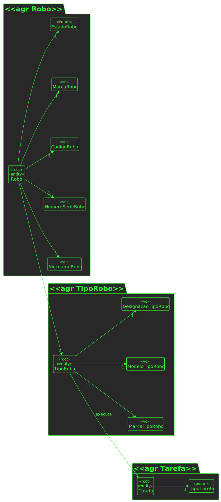

# US 360

## 1. Requisitos

**US360** -  Como gestor de frota pretendo adicionar um novo robot à frota indicando o seu tipo, designação, etc.

## 2. Análise

### 2.1 Indentificar o problema
Para podermos adicionar um robô à frota, temos de indicar os dados necessários para a criação do mesmo. Iremos recorrer ao POST para esse mesmo efeito.

**Respostas do cliente:**

>Pergunta: 
Os atributos do robot têm algum tipo de formatação/restrição?  

>Resposta: 
>- **código**: identificativo, obrigatório, alfanumerico, max 30 caracteres, único no sistema
>- **nickname**: obrigatório, alfanumerico, max 30 caracteres, único no sistema 
>- **tipo de robot**: obrigatório
>- **número de série**: obrigatório, alfanumerico, max 50 caracteres, único para um dado tipo de robot
>- **descrição**: opcional, alfanumerico, max. 250 caracteres

### 2.2 Testes ao requisito

**Test 1:** - Criar robô com sucesso (controlador, 201, POST)

**Test 2:** - Criar robô com insucesso (controlador, 403)

**Test 3:** - Criar robô com sucesso (controlador + service, 201, POST)

**Test 4:** - Cirar robô com insucesso (controlador + service , 403, POST)

**Test 5:** Código do robo segue regras de negocio

**Test 6:** Nickname segue regras de negócio

**Test 7:** Tipo de robot segue regras de negócio

**Test 8:** Número de série segue regras de negócio

**Test 9:** Descricao segue regras de negócio

## 3. Design

Para resolvermos este problema o grupo decidiu tratar do robô como um único agregado com os seus respetivos value objects para obedecer às regras de negócio e para manter a manutentabilidade e expansibilidade.

### 3.1. Realização

### 3.1.1 Excerto do Modelo de Domínio

### 3.1.2 Vista de processos

#### 3.1.2.1 Nível 1

#### 3.1.2.2 Nível 2

#### 3.1.2.3 Nível 3

### 3.1.3 Vista lógica

##### 3.1.3.1 Nível 1

##### 3.1.3.2 Nível 2

##### 3.1.3.3 Nível 3

### 3.1.4 Vista de cenários

#### 3.1.4.1 Nível 1

### 3.1.5 Vista de implementação

#### 3.1.5.1 Nível 2

#### 3.1.5.2 Nível 3

### 3.1.6 Vista física

##### 3.1.6.1 Nível 2

### 3.2. Padrões aplicados
Os padrões aplicados foram:

- REST + ONION (padrões arquiteturais);
- DTO;
- Persistence;
- Controller;
- Service;
- Interfaces;
- Schema;
- Mapper;
- Repository;
- Modelo.