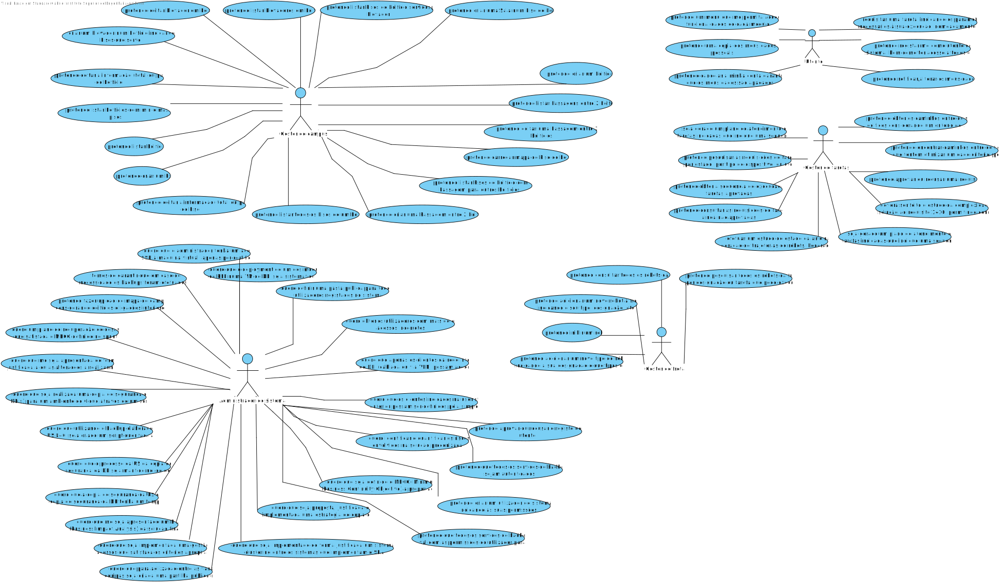

# UC 1050

## 1. Requisitos

**UC1050** - Como gestor de Campus pretendo criar um Edifício indicando [...].

## 2. Análise

### 2.1 Identificar o problema

Implementar a interface de utilizador para a criação do edificio

### 2.2 Excerto do MD

### 2.3 Testes ao requisito

**Test 1:** *Create edificio successful case*

**Test 2:** *Create edificio unsuccessful case*

## 3. Desenho

Para solucionar este problema, foi pensado num agregado para esta entidade, Edifício. É um conceito existente por si só, deve garantir manutenabilidade e expansibilidade.

### 3.1. Realização

#### 3.1.1 Vista de processo

##### 3.1.1.1 Nível 1

##### 3.1.1.2  Nível 2

#### #3.1.1.3  Nível 3

#### 3.1.2 Vista Lógica

##### 3.1.2.1 Nível 1

##### 3.1.2.2 Nível 2

##### 3.1.2.3 Nível 3

#### 3.1.3 Vista de cenários

##### 3.1.3.1 Nível 1

#### 3.1.4 Vista de implementação

##### 3.1.3.1 Nível 2

##### 3.1.3.1 Nível 3

#### 3.1.5 Vista física

##### 3.1.5.1 Nível 2

### 3.2. Padrões aplicados

Os padrões aplicados são:

- Component;
- Services;
- Pipes;
- Diretivas;
- Modelo.
