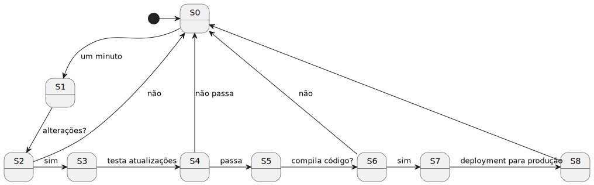

# UC 640

## 1. Requisitos

**UC640** - Como administrador do sistema quero que o deployment de um dos módulos do RFP numa VM do DEI seja sistemático, validando de forma agendada com o plano de testes.

## 2. Análise

### 2.1 Identificação do problema

Qual o módulo "ideal" para ser deployed para uma VM do DEI?
Como implementar o "deployment automático"?
O que é o plano de testes?

### 2.2 Testes ao requisito

**Teste 1:** *...*

## 3. Desenho

### 3.1 Módulo Ideal

A equipa optou por escolher o módulo de front-end para dar o deployment automático para uma VM do DEI. É um módulo simples e fácil de configurar para correr corretamente.

### 3.2 Deployment Automático

Para a implementação do deployment automático, a equipa pensou num bash script que seria adicionado ao crontab do servidor para que conseguisse ser executado com uma frequência X.

### 3.3 Plano de Testes

O plano de testes vai consistir em 2 pontos:

- Testes de compilação + runtime;
- Testes de unidade + integração.

Testes de compilação + runtime vão perceber se a aplicação está com algum problema que leve a uma interrupção inesperada. Enquanto que os testes de unidade + integração vão tentar verificar se as regras de negócio e os diferentes componentes isolados e integrados estão a ser seguidas e a funcionar devidamente.

### 3.4 Notas

#### Logs

Existe um ficheiro designado "audit_log" que vai armzenar todas as informações de sucesso/insucesso ao longo de uma semana. Após esse tempo, é feito um refresh e apagado todo o conteúdo.

#### Workflow

A aplicação vai seguir o workflow da seguinte figura (ponto inicial S0):

A equipa optou passar as novas atualizações do módulo escolhido para produção, apenas depois de garantir que nada "estragado" vai ser posto em produção, daí o passo intermédio de "compila código?".
