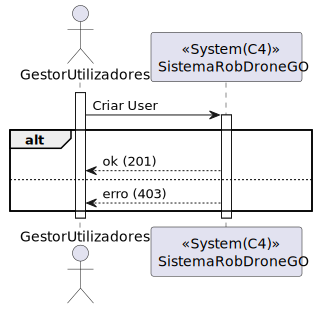
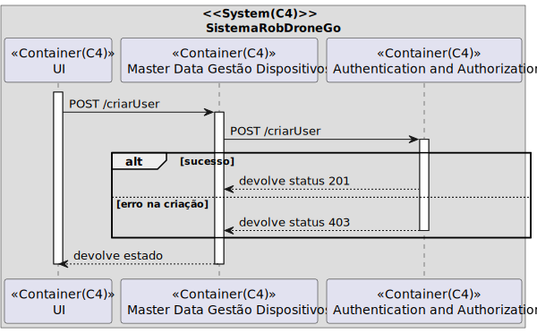
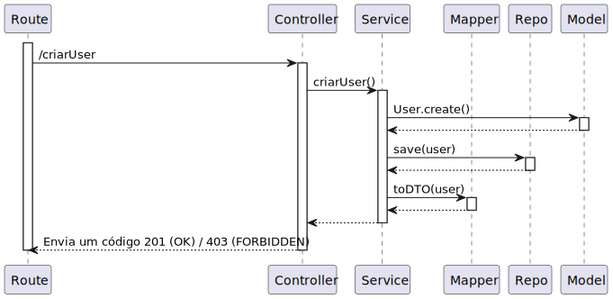

# UC 10

## 1. Requisitos

**UC10** - Como administrador pretendo criar um utilizador de sistema indicando as suas permissões.

## 2. Análise

### 2.1 Identificar o problema

Implementar um método que permita a um administrador criar um utilizador e a sua respetiva interface.

**Respostas do cliente:**

> Pergunta: Que dados são necessários para a criação/registo de um utilizador, para além do seu Role?
>
>Resposta: 
criação de utilizadores e registo de utilizadores são dois casos de uso diferentes e com necessidades distintas.

a criação de utilizadores serve para os administradores de sistema criarem os diversos utilizadores de backoffice do sistema num dos papeis designados, ex., gestor de campus, gestor de frota, gestor de tarefas

o registo de utentes serve para o registo de utilizadores com o papel utente 

em ambos os casos será necessário obter nome, email e telefone.

no registo de utentes deve adicionalmente ser recolhido o número de contribuinte para faturação de serviços

apenas serão aceites emails da organização, ex., isep.ipp.pt.
>
> Pergunta: Our group has questions about USs 10 and 80. What is meant by creating a user with permissions and why would you create a user when a user can sign up (having selected his role) and administrator needs to approve the sign up?
>
>Resposta: user registration is for the students/employees of the university to use the system as a "utente"

user creation is for the administrator to create new backoffice users, e.g., campus manager, fleet manager
>
Pergunta: Como pretende que a atribuição de um Role seja feito?

1. Durante o registo do utente pelo Administrator (US10)

2. Durante o registo do utente pelo próprio utente (US20)

3. Durante a aprovação do registo do utente pelo Administrator (US80)
>
>Resposta: o administrador atribui o papel na criação de utilizadores.
>
>Pergunta: No desenvolvimento da US10 surgiu uma questão em relação à password do utilizador criado. Esta password deve ser gerada automaticamente? Se sim, que requisitos considera para uma password segura e como deve ser a password gerada?
>
>Resposta: de momento a password inicial deve ser introduzida pelo administrador quando cria a conta. a politica de passwords é a seguinte:
- minimo 10 caracteres
- pelo menos 1 letra maiuscula
- pelo menos 1 letra minuscula
- pelo menos 1 digito
- pelo menos 1 simbolo
>
>Pergunta: No contexto da criação de utilizadores, desejo entender como posso identificar e distinguir um utilizador dos demais utilizadores.
>
>Resposta: o email será o username que identifica cada utilizador
>
>Pergunta: Em relação a este requisito, podemos presumir que já houve consentimento por parte do utilizador que vai ser registado?
>
>Resposta: esta funcionalidade apenas permite criar utilizadores de tipo "não utente" para os funcionários da instituição pelo que a aplicação do RGPD e restantes questões de privacidade estão abrangidas pela relação laboral existente

### 2.3 Testes ao requisito

**Test 1:** *Create utilizador successful case (Integração)*

**Test 2:** *Create utilizador unsuccessful case (Integração)*

**Test 3:** *Create password successful case (Unitário)*

**Test 4:** *Create password unsuccessful case (Unitário)*

**Test 5:** *Create NIF successful case (Unitário)*

**Test 6:** *Create NIF unsuccessful case (Unitário)*

**Test 7:** *Create email successful case (Unitário)*

**Test 8:** *Create email unsuccessful case (Unitário)*

**Test 9:** *Create numero telemovel successful case (Unitário)*

**Test 10:** *Create numero telemovel unsuccessful case (Unitário)*

## 3. Desenho

Para solucionar este problema, foi criado um novo agregado de utilizadores e um de roles que estão interligados. Ao ser criado um utilizador de sistema este deve ter a capacidade de executar as tarefas às quais está associado e fazer login no sistema.

### 3.1. Realização

#### 3.1.1 Excerto de domínio

#### 3.1.2 Vista de processo

##### 3.1.2.1 Nível 1

##### 3.1.2.2 Nível 2

##### 3.1.2.3 Nível 3

#### 3.1.3 Vista lógica

##### 3.1.3.1 Nível 1

##### 3.1.3.2 Nível 2

##### 3.1.3.3 Nível 3

#### 3.1.4 Vista de cenários

##### 3.1.4.1 Nível 1

#### 3.1.5 Vista de implementação

##### 3.1.5.1 Nível 2

##### 3.1.5.1 Nível 3

#### 3.1.6 Vista física

##### 3.1.6.1 Nível 2

### 3.2. Padrões aplicados

Os padrões aplicados são:

- REST + ONION (padrões arquiteturais);
- DTO;
- Persistence;
- Controller;
- Service;
- Interfaces;
- Schema;
- Mapper;
- Repository;
- Modelo.
