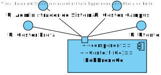
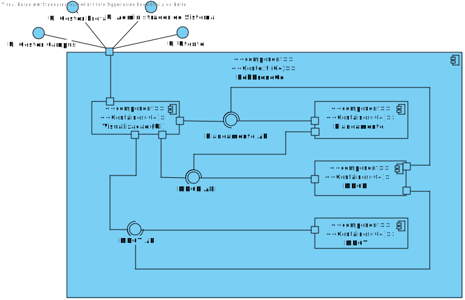
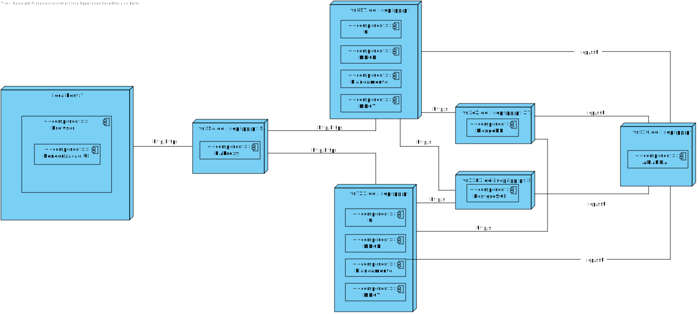

# UC 1320

## 1. Requisitos

**UC1320** - Como arquiteto da solução pretendo que todos os serviços de backend validem as permissões do utilizador para executar determinada operação

## 2. Análise

### 2.1 Identificar o problema

Que método utilizar para implementar uma solução de autorização para todos os serviços de backend?

### 2.2 Respostas do Cliente

Pergunta: 
	Podia especificar melhor o momento em que deve ser feita a verificação das autorizações? Deve ser feita no momento do login onde será demonstrado o menu de acordo com o utilizador (com a us 1300), ou deve ser feita apenas no backend?

Resposta:
	No momento de login deve ser verificado se o utilizador tem acesso à aplicação. em caso afirmativo o menu de opções deve ser ajustado às suas permissões.
	Por uma questão de segurança, todas as operações de serviços devem novamente validar se o pedido é efetuado por um utilizador com permissões para executar essa operação.

### 2.3 Testes ao requisito

**Test 1:** 

**Test 2:** 

## 3. Desenho

Para solucionar este problema, foi implementada uma framework em dotnet para o módulo de autorização para os serviços de backend.

### 3.1. Realização

#### 3.1.1 Vista de processo

##### 3.1.1.1 Nível 1

##### 3.1.1.2  Nível 2

#### #3.1.1.3  Nível 3

#### 3.1.2 Vista Lógica

##### 3.1.2.1 Nível 1

##### 3.1.2.2 Nível 2

 

##### 3.1.2.3 Nível 3

 

#### 3.1.3 Vista de cenários

##### 3.1.3.1 Nível 1

#### 3.1.4 Vista de implementação

##### 3.1.3.1 Nível 2

##### 3.1.3.1 Nível 3

#### 3.1.5 Vista física

##### 3.1.5.1 Nível 2

### 3.2. Padrões aplicados

Os padrões aplicados são:

- Component;
- Services;
- Pipes;
- Diretivas;
- Modelo.
- REST + ONION (padrões arquiteturais);
- DTO;
- Persistence;
- Controller;
- Interfaces;
- Mapper;
- Repository;