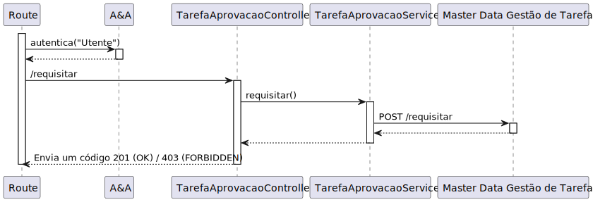

# UC 460

## 1. Requisitos

**UC460** - Como utente do sistema pretendo requisitar uma tarefa indicando os parâmetros necessários à sua execução, nomeadamente o ponto inicial e o término e qual a tarefa pretendida.

## 2. Análise

### 2.1 Identificação do problema

Um utente do sistema deve ser capaz de fazer um pedido de algum tipo (pick up and delivery, vigilância ou limpeza) de forma a que, posteriormente, um gestor de tarefas aceite/recuse.

**Respostas do cliente:**

> Pergunta: Gostaríamos de saber se pretende que fique registado qual foi o utente que requisitou a tarefa.
>
> Resposta: sim. o requerente é uma informação importante a manter.
> <><><><><><><><><><><><><><><><><><><><><><><><><><><><><><><><><><><>
> Pergunta: Na tarefa de Supervision deve ser indicado um contacto para o qual deve ser enviada uma mensagem em caso de necessidade. Este contacto pode/deve ser o do utente que faz a requisição da tarefa? Por exemplo, se um segurança pedir esta tarefa, e em caso de necessidade de contacto, o robot contacta o mesmo segurança que foi quem fez o pedido e é quem deve obter informações acerca da tarefa.
>A mesma questão aplica-se à tarefa de Pickup & Delivery onde o contacto de pickup pode/deve ser o do utilizador que faz a requisição da tarefa, passando apenas o contacto de delivery.
>
> Resposta: o utilizador pode introduzir um contacto que não o dele. exemplo, o docente ABC requista a recolha de uma caneta na secretaria do departamento indicando o contacto de XYZ para entrega na sala de aula XXX ao docente ASD.
>
>de um ponto de vista de usabilidade, será interessante se permitirem ter esses campos pré-preenchidos com os dados do utilizador requisitante.
> <><><><><><><><><><><><><><><><><><><><><><><><><><><><><><><><><><><>
> Pergunta:  O contacto indicado pelo utilizador deve ser o e-mail ou número de telemóvel?
>
> Resposta: na requisição de uma tarefa será necessário indicar um contacto de "pickup" e um contacto de "delivery" (nome e número de telefone)
> <><><><><><><><><><><><><><><><><><><><><><><><><><><><><><><><><><><>
> Pergunta: Em relação a este requisito gostariamos de saber como é feita a atribuição do robot ao pedido de tarefa. É suposto ser o gestor de tarefas, quando for a aprovar a requisição é lhe pedido para associar o robot?
>
> Resposta: como já referido anteriormente o módulo de planeamento deverá ser o responsavel pela atribuição das tarefas aos diferentes robots e subsequente sequenciação das mesmas.
> O algoritmo genético que vos foi fornecido como exemplo efetua o sequenciamento de tarefas para um "executor". Para simplificação é aceite que seja atribuido um robot, de forma automatica, ex., round robin, ou de forma manual pelo gestor de tarefas, quando a requisição é aprovada.
> <><><><><><><><><><><><><><><><><><><><><><><><><><><><><><><><><><><>
> Pergunta: Foi-nos dito, no contexto de ALGAV (modulo de planeamento), que "Nas tarefas do tipo vigilância ou desinfeção os pontos iniciais e finais de cada tarefa estão sempre no mesmo corredor interno de um piso de um edifício". No entanto, numa resposta anterior "As tarefas de vigilância caracterizam-se por indicar qual o edifício e piso(s)" (https://moodle.isep.ipp.pt/mod/forum/discuss.php?d=25045#p31683).
> O que é expectável que aconteça?
Podemos considerar a vigilância de vários pisos como tarefas diferentes?
>
> Resposta: Sim podem considerar as tarefas de vigilância apenas para um piso e o utilizador terá que criar uma requisição para cada piso.
> <><><><><><><><><><><><><><><><><><><><><><><><><><><><><><><><><><><>
> Pergunta: Relativamente ao 'Código de Confirmação', mencionado em https://moodle.isep.ipp.pt/mod/forum/discuss.php?d=25045#p31683, gostava de perceber se este código segue algum formato específico. Além disso, o código será introduzido pelo utilizador que está a requisitar a tarefa, ou deverá ser gerado automaticamente pelo sistema?
>
> Resposta:  o código de confirmação é introduzido pelo requisitante. é um número entre 4 e 6 digitos
> <><><><><><><><><><><><><><><><><><><><><><><><><><><><><><><><><><><>
> Pergunta:  Gostávamos de saber se a descrição de entrega deve ter algum limite de caracteres?
>
> Resposta: para a descrição devem limitar a 1000 caracteres alfanumericos
> <><><><><><><><><><><><><><><><><><><><><><><><><><><><><><><><><><><>
> Pergunta: em relação ao processo da criação da tarefa, o cliente aceita que a tarefa tenha um estado "requisitado" ou entende que o processo se divide em duas etapas distintas: requisição da tarefa e depois a criação da tarefa propriamente dita?
>
> Resposta: o processo de negócio é o seguinte:
> 
>    utente efetua requisição de tarefa
    gestor de tarefas aprova requisição
    gestor de tarefas inicia o planeamento das tarefas aprovadas
>
> se o processo fosse manual correspondia:
>
>    cada utente preenche um papel de requisição e entrega esse papel ao gestor de tarefas
    gestor de tarefas percorre a pilha de requisições e faz dois montes: 1 com as aprovadas outro com as recusadas
    gestor de tarefas coloca as requisições recusadas no arquivo de requisições
    gestor de tarefas pega nas requisições aprovadas e planeia a sua sequencia
    gestor de tarefas pega nas requisições aprovadas e planeadas e coloca-as no arquivo de requisições
>de um ponto de vista concetual é perfeitamente possivel pensar nestes conceitos como "estados" do conceito Tarefa, como eventos do ciclo de vida do conceito, ou como conceitos diferentes.
> <><><><><><><><><><><><><><><><><><><><><><><><><><><><><><><><><><><>
> Pergunta: No caso das tarefas de vigilância, o que se entende por pontos de início e de fim? Uma vez que a tarefa se destina a apenas um piso, seriam então esses pontos salas?
>
> Resposta: devem ser posições de celulas, mas também é aceitável serem salas
> <><><><><><><><><><><><><><><><><><><><><><><><><><><><><><><><><><><>
> Pergunta: Perante este caso de uso, o quê que identificaria uma Tarefa? Podem haver várias tarefas com os mesmos detalhes no sistema?
>
> Resposta: a primeira pergunta já foi respondida no forum.
em relação à segunda pergunta, sim, é perfeitamente possivel um utente fazer duas requisições com as mesmas caracteristicas

### 2.2 Testes ao requisito

**Teste 1:** *Requisitar tarefa com sucesso (controlador, 200 OK)*

**Teste 2:** *Requisitar tarefa com insucesso (controlador, 403 FORBIDDEN)*

**Teste 3:** *Requisitar tarefa com sucesso (controlador + serviço, 200 OK)*

**Teste 4:** *Requisitar tarefa com insucesso (controlador + serviço, 403 FORBIDDEN)*

## 3. Desenho

Para realizar este requisito exisitiu uma grande análise (e reanálise) devido às novas imposições que o cliente foi fazendo ao longo do tempo.

Ao requisitar uma tarefa de pick up and delivery deve ser possível deixar um contato remetente e outro destinatário, um ponto de início e o de destino, a designação da tarefa e descrição. Contrariamente a este tipo de tarefa acabado de mencionar, em tipos de tarefa de vigilância e limpeza só se deve indicar um ponto inicial, o contato do remetente e os resto mantém-se.

Os pontos de início e término são salas do campus.

### 3.1. Realização

#### 3.1.1 Excerto de domínio

#### 3.1.2 Vista de processo

##### 3.1.2.1 Nível 1

##### 3.1.2.2 Nível 2

##### 3.1.2.3 Nível 3

#### 3.1.3 Vista lógica

##### 3.1.3.1 Nível 1

##### 3.1.3.2 Nível 2

##### 3.1.3.3 Nível 3

#### 3.1.4 Vista de cenários

##### 3.1.4.1 Nível 1

#### 3.1.5 Vista de implementação

##### 3.1.5.1 Nível 2

##### 3.1.5.1 Nível 3

#### 3.1.6 Vista física

##### 3.1.6.1 Nível 2

### 3.2. Padrões aplicados

Os padrões aplicados são:

- REST + ONION (padrões arquiteturais);
- DTO;
- Persistence;
- Controller;
- Service;
- Interfaces;
- Schema;
- Mapper;
- Repository;
- Modelo.
