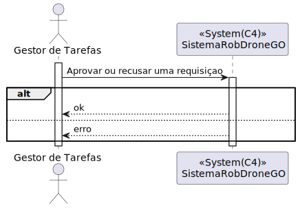

# UC 470

## 1. Requisitos

**UC470** - Como gestor de tarefas pretendo aprovar ou recusar uma requisição.

## 2. Análise

### 2.1 Identificação do problema

O gestor de tarefas tem que conseguir aprovar/recusar requisições feitas por um utente

**Respostas do cliente:**

> Pergunta: Na US480 é pedido para consultar as requisições de tarefas ainda não aprovadas
Na US490 é pedido para pesquisar as requisições de tarefas por estado, por tipo de dispositivo, ou utente.
A partir desta informação, podem haver diferentes interpretações. Uma das interpretações possíveis é que a listagem da US490 engloba a listagem que precisa de ser desenvolvida na US480, já que na tabela da US490 é possível filtrar os requisitos de tarefas por tarefas ainda não aprovadas. Essa filtragem daria a tabela que é pedida na US480.
>
>Com base nesta resposta (https://moodle.isep.ipp.pt/mod/forum/discuss.php?d=26304#p33367) entendemos que irão haver duas tabelas. Uma exclusiva para aprovar ou reprovar tarefas que ainda não foram aprovadas, com os botões "aprovar" e "não aprovar" para cada tarefa, e outra apenas para listar e filtrar todas as tarefas e os vários conceitos relacionados.
>
>Pedíamos que esclarecesse o número de tabelas que pretende que existam, as suas diferenças, e quais permitem a aprovação ou reprovação das tarefas.
>
>Resposta: Sao duas opções distintas. Uma apenas para aprovar ou recusar as tarefas pendentes de decisão.
A outra opção é para consulta de todas as tarefas do sistema, inclusive histórico.

### 2.2 Testes ao requisito

**Teste 1:** *Aprovar requisição com sucesso (controlador, 200 OK)*

**Teste 2:** *Aprovar requisição com insucesso (controlador, 403 FORBIDDEN)*

**Teste 3:** *Rejeitar requisição com sucesso (controlador, 200 OK)*

**Teste 4:** *Rejeitar requisição com insucesso (controlador, 403 FORBIDDEN)*

**Teste 5:** *Aprovar/Recusar requisição com tarefa inválida (controlador + serviço, 403 FORBIDDEN)*

**Teste 6:** *Aprovar requisição com insucesso (controlador + serviço, 403 FORBIDDEN)*

**Teste 7:** *Aprovar requisição com sucesso (controlador + serviço, 200 OK)*

## 3. Desenho

Este requisito foi subdividido em dois: aprovação e rejeição.
Só é necessário receber informação relativa ao requisitante, tarefa e tipo de dispositivo.

### 3.1. Realização

#### 3.1.1 Excerto de domínio

#### 3.1.2 Vista de processo

##### 3.1.2.1 Nível 1

##### 3.1.2.2 Nível 2

##### 3.1.2.3 Nível 3

#### 3.1.3 Vista lógica

##### 3.1.3.1 Nível 1

##### 3.1.3.2 Nível 2

##### 3.1.3.3 Nível 3

#### 3.1.3 Vista de cenários

##### 3.1.3.1 Nível 1

#### 3.1.4 Vista de implementação

##### 3.1.3.1 Nível 2

##### 3.1.3.1 Nível 3

#### 3.1.5 Vista física

##### 3.1.5.1 Nível 2

### 3.2. Padrões aplicados

Os padrões aplicados são:

- REST + ONION (padrões arquiteturais);
- DTO;
- Persistence;
- Controller;
- Service;
- Interfaces;
- Schema;
- Mapper;
- Repository;
- Modelo.
