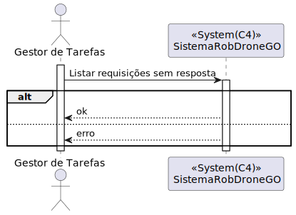

# UC 480

## 1. Requisitos

**UC480** - Como gestor de tarefas pretendo consultar as requisições de tarefas ainda não aprovadas.

## 2. Análise

### 2.1 Identificação do problema

O gestor de tarefas tem que conseguir verificar as requisições feitas por utentes.

**Respostas do cliente:**

> Pergunta: em relação ao processo da criação da tarefa, o cliente aceita que a tarefa tenha um estado "requisitado" ou entende que o processo se divide em duas etapas distintas: requisição da tarefa e depois a criação da tarefa propriamente dita?
>
> Resposta: o processo de negócio é o seguinte:
>
>    * utente efetua requisição de tarefa
>    * gestor de tarefas aprova requisição
>    * gestor de tarefas inicia o planeamento das tarefas aprovadas
>
> se o processo fosse manual correspondia:
>    * cada utente preenche um papel de requisição e entrega esse papel ao gestor de tarefas
>    * gestor de tarefas percorre a pilha de requisições e faz dois montes: 1 com as aprovadas outro com as recusadas
>    * gestor de tarefas coloca as requisições recusadas no arquivo de requisições
>    * gestor de tarefas pega nas requisições aprovadas e planeia a sua sequencia
>    * gestor de tarefas pega nas requisições aprovadas e planeadas e coloca-as no arquivo de requisições   
>
>de um ponto de vista concetual é perfeitamente possivel pensar nestes conceitos como "estados" do conceito Tarefa, como eventos do ciclo de vida do conceito, ou como conceitos diferentes. 
> <><><>
> Pergunta: Como gestor de tarefas, o que pretende ver relativamente à lista de requisições de tarefas?
>
>Era-lhe conveniente ver algum tipo de código para cada tarefa?
Em relação ao utente, o e-mail? 
> Resposta:  cada requisição/tarefa possui um código identificativo que deverá ser gerado pelo sistema e que deverá ser visualizado nas consultas e listagens de tarefas/requisições. em relação aos dados do requerente deve ser mostrado pelo menos a sua identidade (email), mas será interessante mostrarem também o nome do utente
>
>
> <><><>
> Pergunta: Queria esclarecer nesta US se o pretendido é consultar as requisições de tarefas que ainda não foram aprovadas, nem recusadas (ou seja, apresentar só as "pendentes"). Ou se seria pretendido consultar as tarefas "pendentes" + as tarefas recusadas.
>
> Resposta: pretende-se a listagem das requisições pendentes de decisão. Nessa mesma listagem deve existir um botão que permita aprovar ou recusar cada requisição 

### 2.2 Testes ao requisito

**Teste 1:** *Listar requisições sem resposta (ainda) com sucesso (controlador, 200 OK)*

**Teste 2:** *Listar requisições sem resposta com insucesso (controlador, 404 NOT FOUND)*

**Teste 3:** *Listar requisições sem resposta (ainda) com sucesso (controlador + serviço, 200 OK)*

**Teste 4:** *Listar requisições sem resposta com insucesso (controlador + serviço, 404 NOT FOUND)*

## 3. Desenho

Para realizar este requisito basta uma simples listagem às requisições feitas por utentes que ainda não obtiveram resposta.

### 3.1. Realização

#### 3.1.1 Excerto de domínio

#### 3.1.2 Vista de processo

##### 3.1.2.1 Nível 1

##### 3.1.2.2 Nível 2

###### Aprovação

###### Reprovação

##### 3.1.2.3 Nível 3

###### Aprovação

###### Reprovação

#### 3.1.3 Vista lógica

##### 3.1.3.1 Nível 1

##### 3.1.3.2 Nível 2

##### 3.1.3.3 Nível 3

#### 3.1.4 Vista de cenários

##### 3.1.4.1 Nível 1

#### 3.1.5 Vista de implementação

##### 3.1.5.1 Nível 2

##### 3.1.5.1 Nível 3

#### 3.1.6 Vista física

##### 3.1.6.1 Nível 2

### 3.2. Padrões aplicados

Os padrões aplicados são:

- REST + ONION (padrões arquiteturais);
- DTO;
- Persistence;
- Controller;
- Service;
- Interfaces;
- Schema;
- Mapper;
- Repository;
- Modelo.
