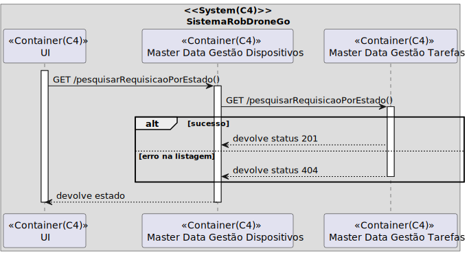

# UC 490

## 1. Requisitos

**UC490** - Como gestor de tarefas pretendo pesquisar as requisições de tarefas por estado, por tipo de dispositivo, ou utente.

## 2. Análise

### 2.1 Identificação do problema

O gestor de tarefas tem que conseguir fazer uma listagem de requisições filtrada com o que entender: estado, tipo de dispositivo ou utente. Esta tarefa pode ser repartida em três.

**Respostas do cliente:**

> Pergunta: To search for task requests by 'type of robot', at which point we should assign the robot type (or perhaps a robot?) to the task?
>
> Resposta: tasks are requested by users and approved by the task manager. the task manager will also trigger the planning module which will take the list of approved requests and generate the execution plan. The execution plan takes into account the robot fleet and as such the output of the planning module will be result in the assignment of task(s) to robot(s) in a sequence that minimizes the overall execution time.
><><><><><><><><><><><><><><><><><><><><><><><><><><><><><><><><><><><><>
> Pergunta: Neste requisito é suposto o utilizador filtrar uma lista de requisições de tarefas ou apenas escolher o tipo de listagem (estado,tipo de dispositivo ou utente) que quer ver e mostrar lhe apenas isso.
>
> Resposta: na listagem resultante deve ser possivel filtrar os dados pelos atributos indicados. Esta opção mostra todas as requisições do sistema, incluindo de datas passadas pelo que deverá também ser possivel filtrar por data de requisição.
>
>notem que o volume de dados pode ser muito grande pelo que devem avaliar tecnicamente como equilibrar este requisito funcional com a sua implementação tecnica. Por exemplo, ao fim de algum tempo o sistema poderá ter milhares (ou dezenas de milhares) de requisições. Embora seja aceitavel para efeitos de prototipo que existam limitações na vossa implementação, tais limitações devem ser devidamente e explcitamente documentadas bem como propostas de alternativas para contornar essas limitações.
><><><><><><><><><><><><><><><><><><><><><><><><><><><><><><><><><><><><>
> Pergunta: Em relação a esta US, nós estamos com umas dúvidas em relação ao que o cliente considera um tipo de dispositivo, por exemplo, seria robots e drones ou tipos especificos de robots?
>
> Resposta: considerar "tipo de robot"

### 2.2 Testes ao requisito

**Teste 1:** *Listar requisições por tipo dispositivo/estado/utente (controlador, 200 OK)*

**Teste 2:** *Listar requisições por tipo dispositivo/estado/utente  (controlador, 404 NOT FOUND)*

**Teste 3:** *Listar requisições por tipo dispositivo/estado/utente  (controlador + serviço, 200 OK)*

**Teste 4:** *Listar requisições por tipo dispositivo/estado/utente  (controlador + serviço, 404 NOT FOUND)*

## 3. Desenho

Visto que os dados aqui inseridos poderão chegar aos milhares em, relativamente, pouco tempo, a equipa desenhou uma forma de contornar a listagem "pesadíssima" que seria listar uma quantidade tão grande informação:
Listaremos o máximo de 500. Mais concretamente, serão listados os últimos 500 registos da base de dados.

O requisito foi repartido por listagem.

### 3.1. Realização

#### 3.1.1 Excerto de domínio

#### 3.1.2 Vista de processo

##### 3.1.2.1 Nível 1

##### 3.1.2.2 Nível 2

###### Tipo de dispositivo

###### Estado

###### Utente

##### 3.1.2.3 Nível 3

###### Tipo de dispositivo

###### Estado

###### Utente

#### 3.1.3 Vista lógica

##### 3.1.3.1 Nível 1

##### 3.1.3.2 Nível 2

##### 3.1.3.3 Nível 3

#### 3.1.4 Vista de cenários

##### 3.1.4.1 Nível 1

#### 3.1.5 Vista de implementação

##### 3.1.5.1 Nível 2

##### 3.1.5.1 Nível 3

#### 3.1.6 Vista física

##### 3.1.6.1 Nível 2

### 3.2. Padrões aplicados

Os padrões aplicados são:

- REST + ONION (padrões arquiteturais);
- DTO;
- Persistence;
- Controller;
- Service;
- Interfaces;
- Schema;
- Mapper;
- Repository;
- Modelo.
