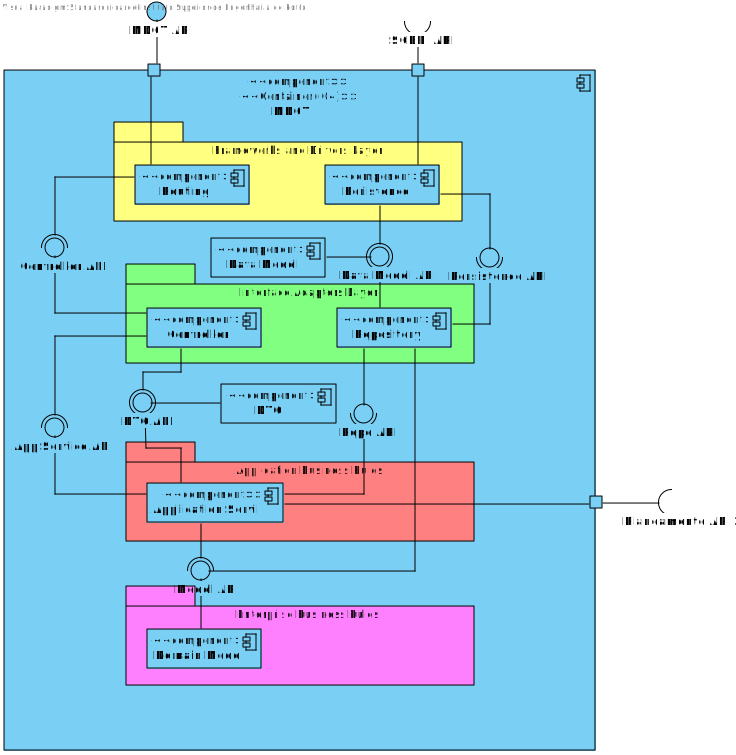
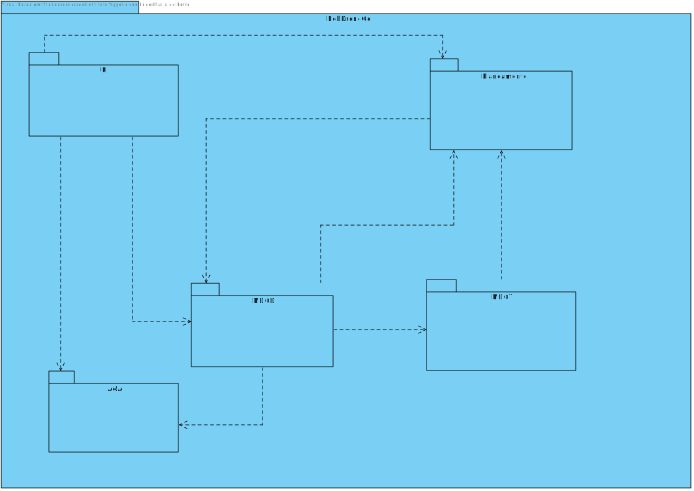

# UC 490

## 1. Requisitos

**UC490** - Como gestor de tarefas pretendo pesquisar as requisições de tarefas por estado, por tipo de dispositivo, ou utente.

## 2. Análise

### 2.1 Identificação do problema

O gestor de tarefas tem que conseguir fazer uma listagem de requisições filtrada com o que entender: estado, tipo de dispositivo ou utente. Esta tarefa pode ser repartida em três.

### 2.2 Testes ao requisito

**Teste 1:** *Listar requisições por tipo dispositivo/estado/utente (controlador, 200 OK)*

**Teste 2:** *Listar requisições por tipo dispositivo/estado/utente  (controlador, 404 NOT FOUND)*

**Teste 3:** *Listar requisições por tipo dispositivo/estado/utente  (controlador + serviço, 200 OK)*

**Teste 4:** *Listar requisições por tipo dispositivo/estado/utente  (controlador + serviço, 404 NOT FOUND)*

## 3. Desenho

Visto que os dados aqui inseridos poderão chegar aos milhares em, relativamente, pouco tempo, a equipa desenhou uma forma de contornar a listagem "pesadíssima" que seria listar uma quantidade tão grande informação:
Listaremos o máximo de 500. Mais concretamente, serão listados os últimos 500 registos da base de dados.

O requisito foi repartido por listagem.

### 3.1. Realização

#### 3.1.2 Vista de processo (Listagem por Estado)

##### 3.1.2.1 Nível 1

##### 3.1.2.2 Nível 2

###### Tipo de dispositivo

###### Estado

###### Utente

##### 3.1.2.3 Nível 3

###### Tipo de dispositivo

###### Estado

###### Utente

#### 3.1.3 Vista lógica

##### 3.1.3.1 Nível 1

##### 3.1.3.2 Nível 2

##### 3.1.3.3 Nível 3

#### 3.1.4 Vista de cenários

##### 3.1.4.1 Nível 1

#### 3.1.5 Vista de implementação

##### 3.1.5.1 Nível 2

##### 3.1.5.1 Nível 3

#### 3.1.6 Vista física

##### 3.1.6.1 Nível 2

### 3.2. Padrões aplicados

Os padrões aplicados são:

- REST + ONION (padrões arquiteturais);
- DTO;
- Persistence;
- Controller;
- Service;
- Interfaces;
- Schema;
- Mapper;
- Repository;
- Modelo.