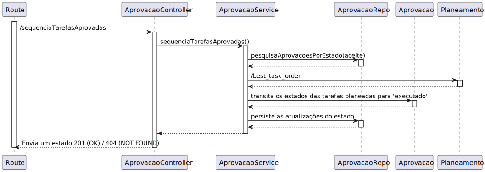

# UC 500

## 1. Requisitos

**UC500** - Como gestor de tarefas pretendo obter a sequencia de execução das tarefas aprovadas.

**Nota:** interligação com requisito 1410/1430. deve permitir escolher qual o algoritimo a utilizar.

## 2. Análise

### 2.1 Identificação do problema

O gestor de tarefas deve conseguir, após aprovar tarefa(s) que por outras palavras é transitá-las para o estado "aceite", gerar uma sequência que otimize o tempo. Este requisito deve integrar o módulo de gestão de tarefas e o planeamento.

**Respostas do cliente:**

> Pergunta: Na US500, é dito "Como gestor de tarefas pretendo obter a sequencia de execução das tarefas aprovadas".  Devemos ter também em conta tarefas que foram previamente planeadas, ou apenas aquelas que se encontram exclusivamente 'aprovadas'.
>
> Resposta: apenas devem ser planeadas as tarefas que foram aprovadas e ainda não planeadas. uma tarefa depois de planeada seria enviada para o módulo de execução dos robots (fora de âmbito do prototipo).
><><><><><><><><><><><><><><><><><><><><><><><><><><><><><><><><><><><><>
> Pergunta: Nesta US é pretendido que um Gestor de Tarefas consiga obter a sequência de execução das tarefas aprovadas. Em que é que consiste essa sequência de execução? É suposto mostrar uma lista com todas as tarefas aprovadas com alguma ordem específica?
>
> Resposta:  esse requisito corresponde a obter o resultado do módulo de planeamento.
><><><><><><><><><><><><><><><><><><><><><><><><><><><><><><><><><><><><>
> Pergunta: Based on what data/criteria (of a request) should the execution sequence of approved tasks be made? What is the priority to place some task ahead of another one? Should it be more sophisticated than executing approved (and assigned to a robot) requests in requesting order (first come first served)?
>
> Resposta: according to what is stated in requirement 1410: "seja gerado um plano de atendimento das tarefas indicadas que indique uma sequência de execução das tarefas que seja criada através da geração de todas as sequências e escolha da que durar menos tempo.", that is, the sequence that takes the least amount of time to execute.
>
>You can consider average times to calculate the duration of a request execution, for instance:
>
>    move from one cell to another cell
    traverse a passage from one building to another
    use the elevator from one floor to an adjacent one
    pickup an object
    deliver an object
>
> for simplicity you might assume a standard time for:
>
>    pickup and delivery in the same building/floor
    pickup and delivery in the same building, different floor
    pickup and delivery in different buildings
    surveillance of a floor
>
> all assumptions and simplifications must be properly identified, justified and explained.
>
> There are currently no priority request. all request of the same type should be considered with equal priority

### 2.2 Testes ao requisito

**Teste 1:** *Obter sequência de execução (controlador, 200 OK)*

**Teste 2:** *Obter sequência de execução (controlador, 404 NOT FOUND)*

**Teste 3:** *Obter sequência de execução (controlador + serviço, 200 OK)*

**Teste 4:** *Obter sequência de execução (controlador + serviço, 404 NOT FOUND)*

## 3. Desenho

Para a realização deste requisito, a equipa decidiu que seria feita uma pesquisa por todas as tarefas que estejam com o estado 'aceite' para serem enviadas para o módulo de planeamento (através de um pedido HTTP enviando um JSON com designação da tarefa, ponto de início e ponto de término).

### 3.1. Realização

#### 3.1.1 Excerto de domínio

#### 3.1.2 Vista de processo

##### 3.1.2.1 Nível 1

##### 3.1.2.2 Nível 2

##### 3.1.2.3 Nível 3

#### 3.1.3 Vista lógica

##### 3.1.3.1 Nível 1

##### 3.1.3.2 Nível 2

##### 3.1.3.3 Nível 3

#### 3.1.4 Vista de cenários

##### 3.1.4.1 Nível 1

#### 3.1.5 Vista de implementação

##### 3.1.5.1 Nível 2

##### 3.1.5.1 Nível 3

#### 3.1.6 Vista física

##### 3.1.6.1 Nível 2

### 3.2. Padrões aplicados

Os padrões aplicados são:

- REST + ONION (padrões arquiteturais);
- DTO;
- Persistence;
- Controller;
- Service;
- Interfaces;
- Schema;
- Mapper;
- Repository;
- Modelo.
