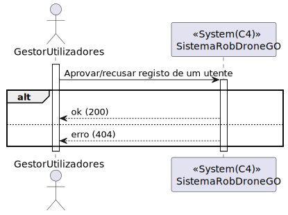
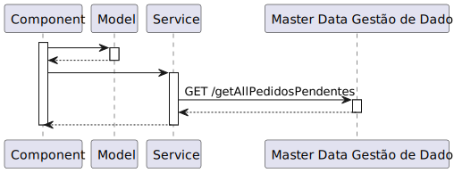

# UC 80

## 1. Requisitos

**UC80** -Como administrador do sistema pretendo aprovar ou recusar o registo de um utente

## 2. Análise

### 2.1 Identificar o problema

Implementar um método que permita a um administrador aprovar ou recusar o registo de um utente

**Respostas do cliente:**

> Pergunta: Como pretende que a atribuição de um Role seja feito?
Durante a aprovação do registo do utente pelo Administrator (US80)
>
>Resposta: 
o administrador atribui o papel na criação de utilizadores.
os utilizadores que utilizem a funcionalidade de registo serão sempre do tipo "utente"

### 2.3 Testes ao requisito

## 3. Desenho

### 3.1. Realização

#### 3.1.1 Excerto de domínio

#### 3.1.2 Vista de processo

##### 3.1.2.1 Nível 1

##### 3.1.2.2 Nível 2

##### 3.1.2.3 Nível 3

##### Pedidos pendentes

##### Aprovar pedido

##### Recusar pedido

#### 3.1.3 Vista lógica

##### 3.1.3.1 Nível 1

##### 3.1.3.2 Nível 2

##### 3.1.3.3 Nível 3

#### 3.1.4 Vista de cenários

##### 3.1.4.1 Nível 1

#### 3.1.5 Vista de implementação

##### 3.1.5.1 Nível 2

##### 3.1.5.1 Nível 3

#### 3.1.6 Vista física

##### 3.1.6.1 Nível 2

### 3.2. Padrões aplicados

Os padrões aplicados são:

- Component;
- Services;
- Pipes;
- Diretivas;
- Modelo.
- REST + ONION (padrões arquiteturais);
- DTO;
- Persistence;
- Controller;
- Interfaces;
- Mapper;
- Repository;

