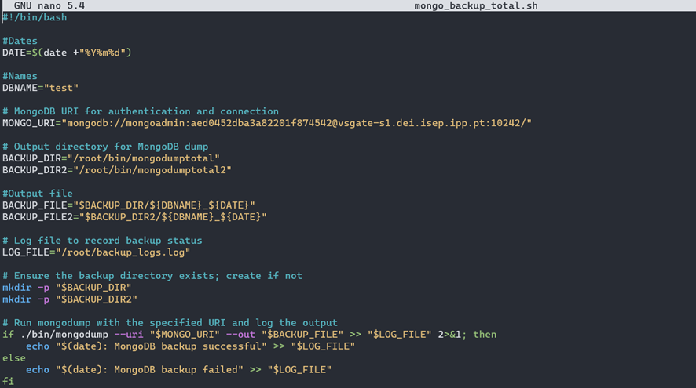

# User Story 3

## Requisitos
Como administrador de sistemas quero que seja realizada uma cópia de segurança da(s) DB(s) para um ambiente de Cloud através de um script que a renomeie para o formato<nome_da_db> _yyyymmdd sendo <nome_da_db> o nome da base de dados, yyyy o ano de realização da cópia, mm o mês de realização da cópia e dd o dia da realização da cópia.

## Esclarecimentos do cliente

Questão: 

Resposta: 

## Desenho

É importante que qualquer organização organize bem os seus backups, com a correta nomenclatura, no local indicado, para que quando exista necessidade de os usar ou modificar algo relacionado com os backups, ser fácil para o administrador de sistemas se localizar e agir o mais rapidamente perante uma necessidade, seja esta uma emergência ou não. De salientar, que uma boa gestão dos backups, pode significar uma poupança de milhares para a empresa.

## Resolução do Problema
Para resolver este problema, foi bastante simples, necessitando apenas de fazer algumas alterações ao script de backups feito no Sprint anterior. 

Como é possível observar na figura acima apresentada, as alterações que foram feitas para cumprir com a nomenclatura dos ficheiros de backup, são referentes ao “BACKUP_FILE” que especifica tanto onde é que irá ser guardado, bem como o nome que lhe será dado. No inicio do script foi criada tanto uma variável de data, bem como uma variável com o nome da base de dados, que posteriormente são utilizados na construção da variável “BACKUP_FILE”, que cumpre com a nomenclatura “<nome_da_db>_yyyymmdd”.
