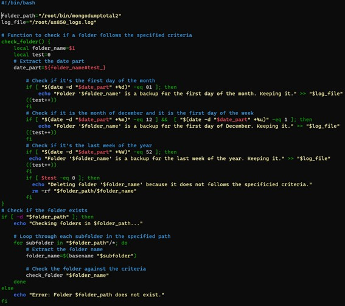

# UC 850

## 1. Requisitos

Como administrador de sistemas quero que utilizando o Backup elaborado na US 840, seja criado um script quer faça a gestão dos ficheiros resultantes desse backup, no seguinte calendário. 1 Backup por mês no último ano, 1 backup por semana no último mês, 1 backup por dia na última semana

***Dependência:*** US 840

## 2. Esclarecimentos do cliente

**Questão:** O que é que é pretendido por "a gestão dos ficheiros resultantes desse backup" no contexto desta US?

**Resposta:** O texto completo da US é :"Como administrador de sistemas quero que utilizando o Backup elaborado na US 840, seja criado um script quer faça a gestão dos ficheiros resultantes desse backup, no seguinte calendário. 1 Backup por mês no último ano, 1 backup por semana no último mês, 1 backup por dia na última semana". Na US 840 são realizadas cópias de segurança de acordo com um dado critério. Com "gestão" pretende-se a eliminação dos backups que não obedeçam aos princípios enunciados.

## 3. Desenho

Na US C3 é criado um backup com um dado critério, neste caso {nome da bd}_{data de realização do backup}. O objetivo da US C4 é verificar se o backup realizado se encontra de acordo com o pedido na gestão de ficheiros. Caso contrário, esse backup será descartado. Os ficheiros aceites serão apenas os que cumprem um ou mais dos seguintes requisitos: 
* 1 Backup por mês no último ano;
* 1 Backup por semana no último mês;
* 1 Backup por dia na última semana;

## 4. Resolução do problema

De modo a satisfazer o requisito da US C4 foi elaborado um script para realizar a filtragem dos backups realizados.
No script apresentado cada backup será guardado numa pasta. Para a gestão dos backups um ciclo for percorre cada pasta de backups e analisa a data desse mesmo. Caso a data não corresponda ao pedido, essa mesma pasta e os seus ficheiros serão eliminados.

