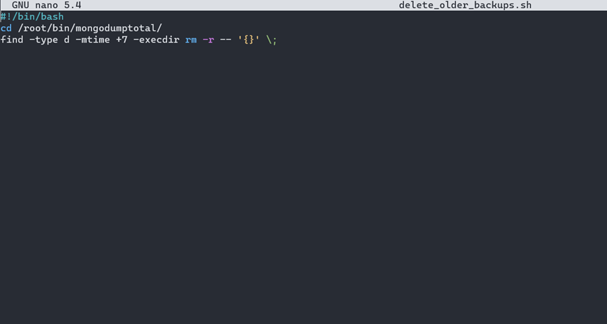

# User Story 6

## Requisitos
Como administrador de sistemas quero que a cópia de segurança da US da cópia de segurança da DB tenha um tempo de vida não superior a 7 (sete) dias exceto no indicado na US de retenção das cópias mensais e anuais

## Esclarecimentos do cliente

Questão: 

Resposta: 

## Desenho

É importante que qualquer organização organize bem os seus backups, e que tenha os que realmente necessita disponíveis, porque ter backups além dos necessários, significa uma maior dificuldade na organização dos mesmos, e significa também maiores custos de armazenagem, o que para qualquer organização é negativo.

## Resolução do Problema
Para resolver este problema, foi necessário criar um script, que procura dentro da pasta de backups, pastas com mais de 7 dias desde a sua criação.
 
 

Como é possível verificar na figura acima apresentada, este script navega até à pasta onde se encontram guardados os backups, procura uma pasta com mais de 7 dias desde a sua criação através do “-mtime +7”, e caso encontre, remove-a com o “rm -r”, que executa recursivamente até não existirem mais pastas com mais de 7 dias desde a sua criação. 
