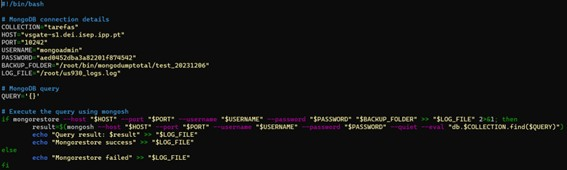

# UC 930

## 1. Requisitos

Como administrador de sistemas temos de garantir que em caso de necessidade os backups foram efetuados corretamente. Para isso devemos automatizar a sua reposição, validando no final o funcionamento do sistema (Ex. Base de Dados - executar uma query SQL com sucesso após reposição).

## 2. Esclarecimentos do cliente

**Questão:** O que se pretende em concreto neste requisito? é relativo à US840? O objetivo é comparar o backup com a base de dados?

**Resposta:** Não exclusivamente. A menção à DB é apresentada como um exemplo. O pretendido é definir um procedimento para validar que em caso de necessidade de reposição não se obtém a surpresa desagradável de verificar que o backup não foi realizado com sucesso.
Como exemplo - aliás, apresentado como tal na US - repor a DB ou parte dela para outro local e validar se os dados estão conformes. Claro que há outros métodos, como faz para verificar se o backup dos seus dados foi feito com sucesso?

## 3. Desenho

É necessário a reposição de dados através de um backup em caso de uma falha num sistema. Existem diversas maneiras, mas a mais eficiente será a execução de uma query à base de dados.

## 4. Resolução do problema

O primeiro passo foi instalar o mongodb server e mongodb shell de modo a ter acesso à base de dados e ser possivel executar queries.
Para resolver este problema foi criado um script que irá fazer o restore da base de dados através do comando mongorestore. Este comando irá estar envolvido dentro de uma condição if e o seu valor de retorno determinirá o sucesso ou insucesso da operação. Após sucesso da reposição dos dados uma query será feita através do comando mongosh. Ambos os resultados serão dispostos num ficheiro de logs.

