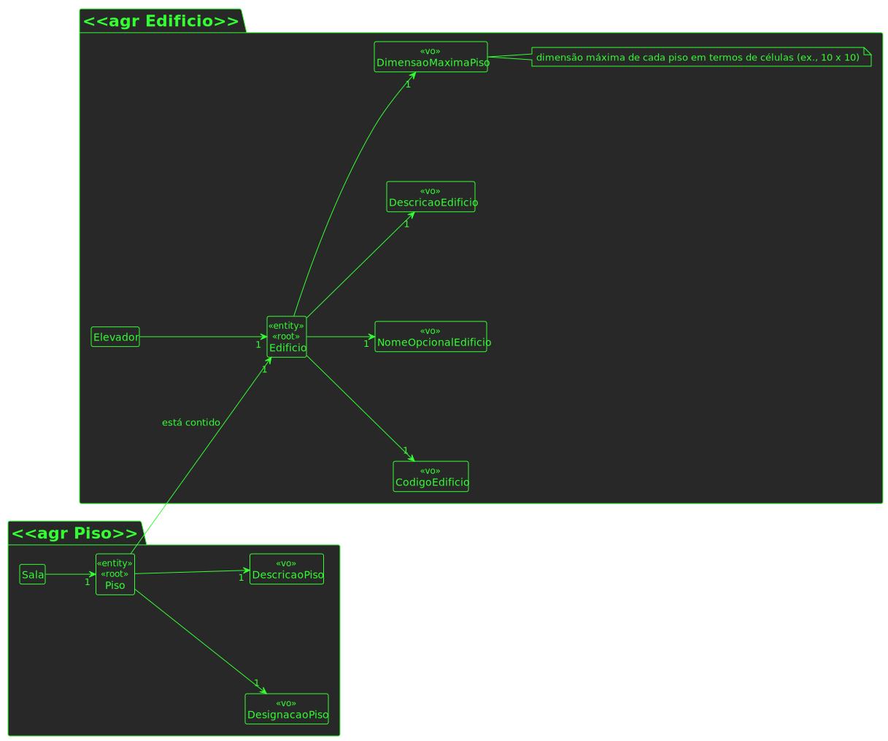

# US 190

## 1. Requisitos

**US190** -  Criar piso de edifício.

> Questão: Será possível esclarecer como funcionarão estas user stories? Com a 230 (Carregar mapa do piso) o nosso entendimento foi que as células seriam carregadas já com a criação de salas e pisos, e assim sendo não faria sentido as outras duas user stories, onde é pedido para criar um piso de um edifício e uma sala. Não entendemos o que é pretendido  com as us's 190 e 310.
>
> Resposta: O requisito 190 Criar piso permite definir um piso para um dos edificios criados anteriormente, por exemplo, o piso 1 do edificio B com uma breve descrição (ex., "salas TP")

## 2. Análise

### 2.1 Identificar o problema

A criação de um piso de edíficio é um conceito importante do domínio. É necessário poder adicionar pisos a um edifício.

### 2.2 Excerto do MD

### 2.3 Testes ao requisito

**Teste 1:** *Criar piso com sucesso (controlador, 201 POST)*

**Teste 2:** *Criar piso com insucesso (controlador, 403 FORBIDDEN)*

**Teste 3:** *Criar piso com sucesso (controlador + serviço, 201 POST)*

**Teste 4:** *Criar piso com insucesso (controlador + serviço, 403 FORBIDDEN)*

**Teste 5:** *Designação de piso segue regras de negócio.*

**Teste 6:** *Descrição segue regras de negócio.*

## 3. Design

Para resolver este problema, a equipa optou por fazer um agregado próprio: Piso. É necessário garantir manutebiliade e expansibilidade.

### 3.1. Realização

#### 3.1.1 Excerto de domínio

#### 3.1.2 Vista de processo

##### 3.1.2.1 Nível 1

##### 3.1.2.2 Nível 2

##### 3.1.2.3 Nível 3

#### 3.1.3 Vista lógica

##### 3.1.3.1 Nível 1

##### 3.1.3.2 Nível 2

##### 3.1.3.3 Nível 3

#### 3.1.3 Vista de cenários

##### 3.1.3.1 Nível 1

#### 3.1.4 Vista de implementação

##### 3.1.3.1 Nível 2

##### 3.1.3.1 Nível 3

#### 3.1.5 Vista física

##### 3.1.5.1 Nível 2

### 3.2. Padrões aplicados

Os padrões aplicados são:

- REST + ONION (padrões arquiteturais);
- DTO;
- Persistence;
- Controller;
- Service;
- Interfaces;
- Schema;
- Mapper;
- Repository;
- Modelo.
