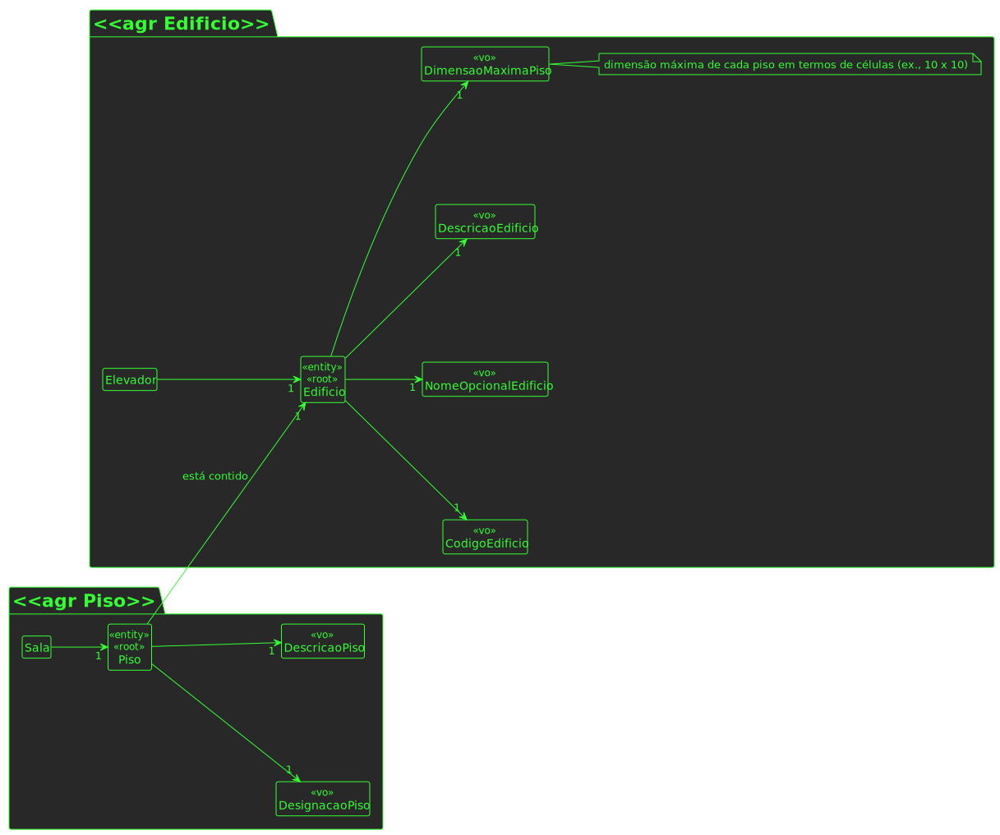

# UC 200

## 1. Requisitos

**UC200** - Editar informação de piso de edificio.

## 2. Análise

### 2.1 Identificação do problema

> Questão: Em relação às User Stories de edição, temos já uma ideia das informações que são opcionais, mas queremos ter a certeza daquilo que é editável ou não. Posto isto, poderia indicar que informações pretende editar nas US160, US200, US250 e US280? 
>
>Resposta: requisito 200 - editar piso - todas as informações à exceção do edificio a que o piso se refere

### 2.2 Testes ao requisito

**Teste 1:** *updatePiso returns status 404*

**Teste 2:** *updatePiso returns piso json*

**Teste 3:** *updatePiso: pisoController +pisoService integration test using spy on pisoService, success*

**Teste 4:** *updatePiso: pisoController + pisoService integration test using spy on pisoService, unsuccess piso already exists*

**Teste 5:** *updatePiso: pisoController + pisoService integration test using spy on pisoService, unsuccess edificio doesnt exist*

## 3. Desenho

### 3.1. Realização

#### 3.1.1 Excerto de domínio

#### 3.1.2 Vista de processo

##### 3.1.2.1 Nível 1

##### 3.1.2.2 Nível 2

##### 3.1.2.3 Nível 3

#### 3.1.3 Vista lógica

##### 3.1.3.1 Nível 1

##### 3.1.3.2 Nível 2

##### 3.1.3.3 Nível 3

#### 3.1.3 Vista de cenários

##### 3.1.3.1 Nível 1

#### 3.1.4 Vista de implementação

##### 3.1.3.1 Nível 2

##### 3.1.3.1 Nível 3

#### 3.1.5 Vista física

##### 3.1.5.1 Nível 2

### 3.2. Padrões aplicados

Os padrões aplicados são:

- REST + ONION (padrões arquiteturais);
- DTO;
- Persistence;
- Controller;
- Service;
- Interfaces;
- Schema;
- Mapper;
- Repository;
- Modelo.
