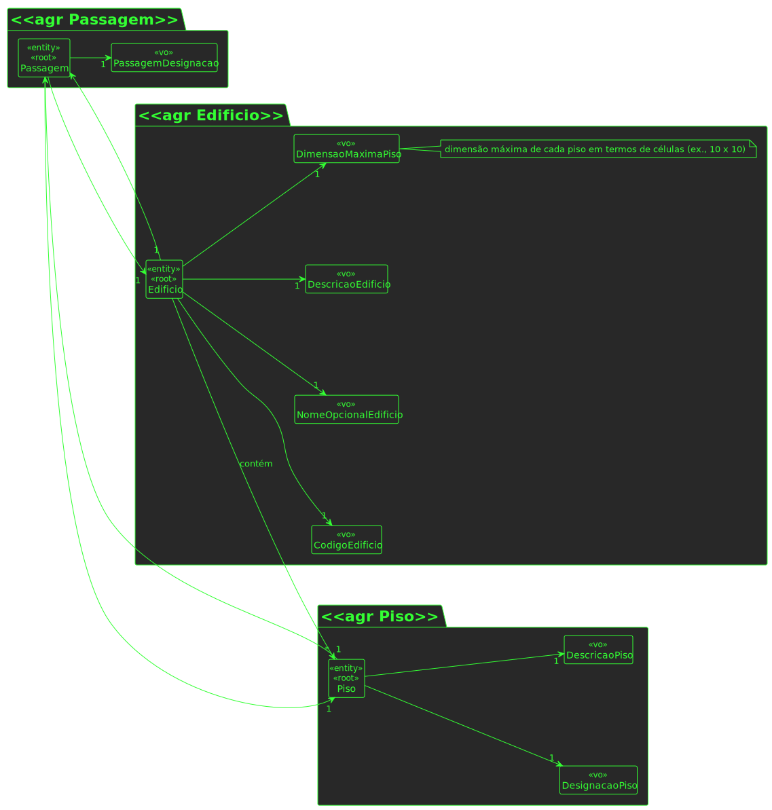

# UC 220

## 1. Requisitos

**UC220** - Listar pisos de edifício com passagem para outros edifícios.

## 2. Análise

### 2.1 Identificar o problema

Listar pisos de um edifício que tenha passagem para outros edifícios é obtido através do GET, e deve listar todos os pisos que tenham as respetivas passagens para outros edificios.

### 2.2 Excerto do MD

### 2.3 Testes ao Requisito

**Teste 1:** *Listar pisos de edificio com passagem para outros edifícios com sucesso (controlador, 200 GET)*

**Teste 2:** *Listar pisos de edificio com passagem para outros edifícios com insucesso (controlador, 404 NOT FOUND)*

**Teste 3:** *Listar pisos de edificio com passagem para outros edifícios com sucesso (controlador + serviço, 200 GET)*

**Teste 4:** *Listar pisos de edificio com passagem para outros edifícios com insucesso (controlador + serviço, 404 NOT FOUND)*

## 3. Desenho

Para solucionar este problema, existe um agregado designado por Passagem que tem como atributos um edificio A, outro edificio B, um piso do edificio A e outro piso do edificio B. Desta forma, é possível listar todas as passagens do edificio A para outros edificios, e assim, listar os pisos correspondentes.

### 3.1. Realização

### 3.1.1 Vista de Processos

#### 3.1.1.3 Vista de processo - nível 1

#### 3.1.1.3 Vista de processo - nível 3

#### 3.1.1.3 Vista de processo - nível 3

### 3.1.3 Vista lógica

##### 3.1.3.1 Nível 1

##### 3.1.3.2 Nível 2

##### 3.1.3.3 Nível 3

### 3.1.4 Vista de cenários

#### 3.1.4.1 Nível 1

### 3.1.5 Vista de implementação

#### 3.1.5.1 Nível 2

#### 3.1.5.2 Nível 3

### 3.1.6 Vista física

##### 3.1.6.1 Nível 2

### 3.2. Padrões aplicados

Os padrões aplicados são:

- DTO;
- Persistence;
- Controller;
- Service;
- Interfaces;
- Schema;
- Mapper;
- Repository;
- Modelo.
