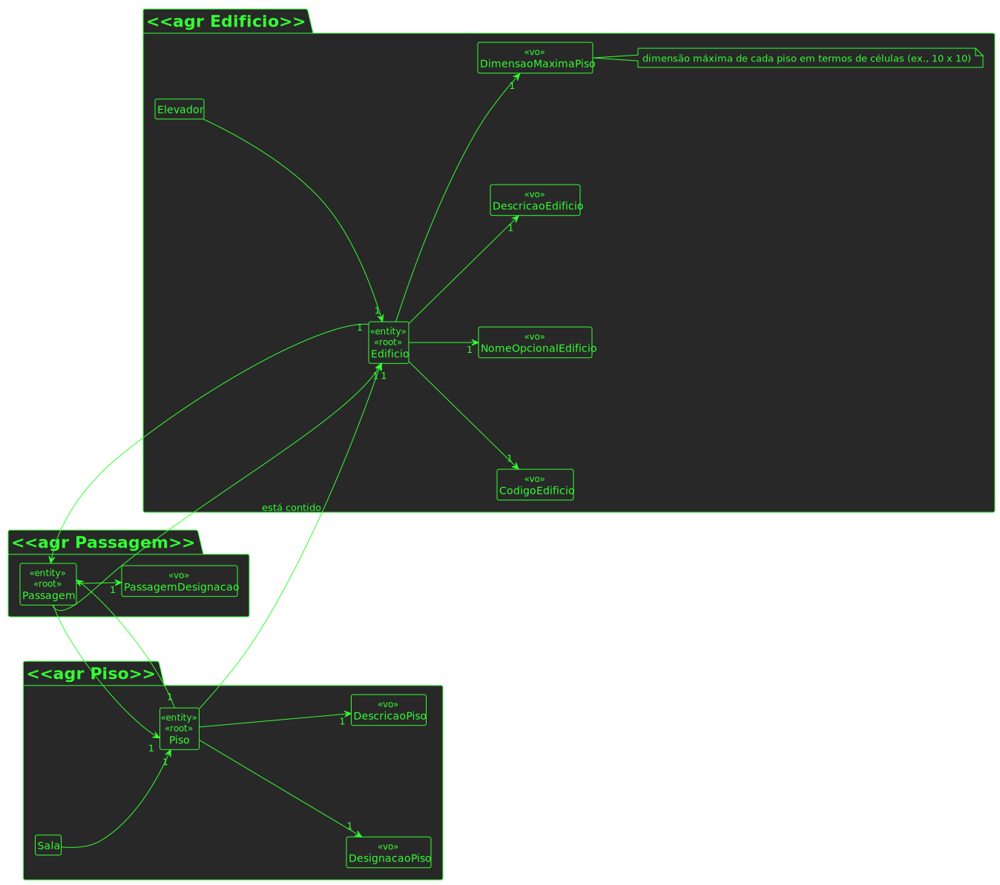

# US 240

## 1. Requisitos

**US240** -  Criar passagem entre edifícios

## 2. Análise

### 2.1 Indentificar o problema
Para ser possível criar uma passagem entre edifícios é necessário fornecer dados relativamente aos edificios e aos pisos em questão de cada edificio, usando o POST.

**Respostas do cliente:**

> Pergunta: No mesmo edifício é possível ter duas passagens para outro edifício, em pisos diferentes? 
Por exemplo, do edifício B existir uma passagem para o edifício G no piso 2 e outra no piso 3 também para o G. 
>
>Resposta: Sim. em cada piso podem existir várias passagens, cada uma para outro edificio, e no mesmo edificio podem existir várias passagens para um outro edificio desde que em pisos diferentes.

### 2.2 Excerto do MD

### 2.3 Testes ao requisito

**Test 1:** *Criar passsagem entre edifícios com sucesso (controlador, 201 POST)*

**Test 2:** *Criar passsagem entre edifícios com insucesso (controlador, 403 FORBIDDEN)*

**Test 3:** *Criar passsagem entre edifícios com sucesso (controlador + serviço, 201 POST)*

**Test 4:** *Criar passsagem entre edifícios com insucesso (controlador + serviço, 403 FORBIDDEN)*

## 3. Desenho

Para solucionar este problema, foi pensado num agregado para esta entidade, Passagem. É um conceito existente por si só, deve manter manutenabilidade e expansibilidade.

### 3.1. Realização

#### 3.3.1 Vista de processo - nível 3

#### 3.3.2 Vista lógica - nível 3

### 3.2. Padrões aplicados
Os padrões aplicados são:
- REST + ONION (padrões arquiteturais);
- DTO;
- Persistence;
- Controller;
- Service;
- Interfaces;
- Schema;
- Mapper;
- Repository;
- Modelo.