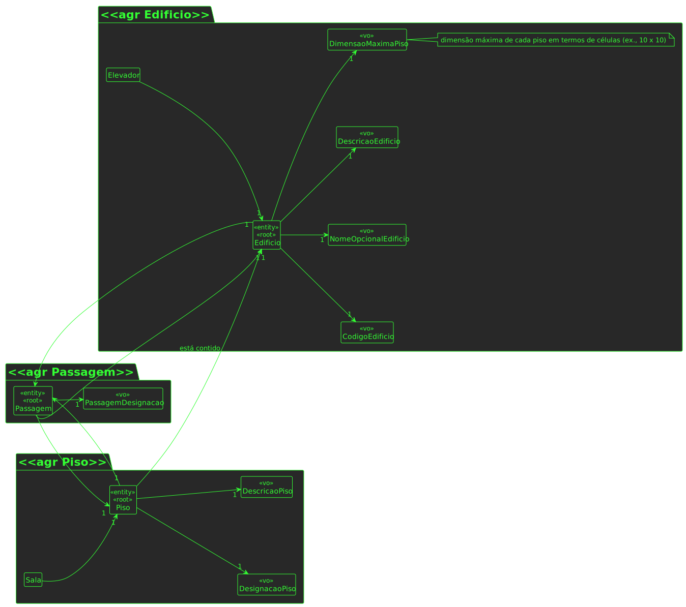

# US 250

## 1. Requisitos

**US250** -  Editar passagem entre edifícios

## 2. Análise

### 2.1 Indentificar o problema
Para ser possível editar uma passagem entre edifícios é necessário fornecer dados relativamente aos edificios e aos pisos em questão de cada edificio, bem como um elemento identificador da passagem que vamos alterar, usando o PUT.

**Respostas do cliente:**

> Pergunta: O que é que pretende que seja possivel editar numa passagem entre edificios?
>
>Resposta: Deve ser possivel corrigir todos os dados da passagem

### 2.2 Excerto do MD

### 2.3 Testes ao requisito

**Test 1:** *Editar passsagem entre edifícios com sucesso (controlador, 201 POST)*

**Test 2:** *Editar passsagem entre edifícios com insucesso (controlador, 403 FORBIDDEN)*

**Test 3:** *Editar passsagem entre edifícios com sucesso (controlador + serviço, 201 POST)*

**Test 4:** *Editar passsagem entre edifícios com insucesso (controlador + serviço, 403 FORBIDDEN)*

**Test 5:** *Editar passagem entre edifícios com insucesso (edificioA e edificioB são iguais)*

**Test 6:** *Editar passagem entre edifícios com insucesso (pisoA e pisoB são iguais)*

**Test 7:** *Editar passagem entre edifícios com insucesso (designação da passagem não existe)*

## 3. Desenho

Para resolver este problema, é pedido ao utilizador os parametros a atualizar da passagem.

### 3.1. Realização

### 3.1.1 Vistas de Processo

#### 3.1.1.1 Vista de processo - nível 3

#### 3.3.1.2 Vista de processo - nível 3

#### 3.3.1.3 Vista de processo - nível 3

### 3.3.2 Vistas lógicas

#### 3.3.2.1 Vista lógica - nível 1

#### 3.3.2.2 Vista lógica - nível 2

#### 3.3.2.3 Vista lógica - nível 3

#### 3.1.3 Vista de cenários

##### 3.1.3.1 Nível 1

#### 3.1.4 Vista de implementação

##### 3.1.3.1 Nível 2

##### 3.1.3.1 Nível 3

#### 3.1.5 Vista física

##### 3.1.5.1 Nível 2

### 3.2. Padrões aplicados
Os padrões aplicados são:
- REST + ONION (padrões arquiteturais);
- DTO;
- Persistence;
- Controller;
- Service;
- Interfaces;
- Schema;
- Mapper;
- Repository;
- Modelo.