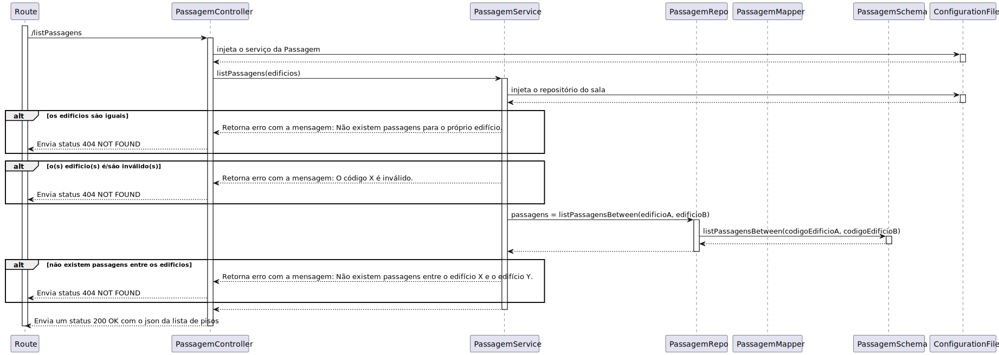

# UC 260

## 1. Requisitos

**UC260** - Listar passagens entre 2 edifícios.

## 2. Análise

### 2.1 Identificar o problema

Listar passagens entre 2 edifícios deve apresentar todas as passagens que conectem um edificio A a um edificio B (todas as passagens são bidirecionais).

### 2.2 Testes ao requisito

**Teste 1:** *Listar passagens com sucesso (controlador, 200 GET)*

**Teste 2:** *Listar passagens com insucesso (controlador, 404 NOT FOUND)*

**Teste 3:** *Listar passagens com sucesso (controlador + serviço, 200 GET)*

**Teste 4:** *Listar passagens com insucesso (controlador + serviço, 404 NOT FOUND)*

## 3. Desenho

Para solucionar este problema, existe um agregado designado por Passagem que tem como atributos um edificio A, outro edificio B, um piso do edificio A e outro piso do edificio B. Desta forma, é possível listar todos as passagens entre dois edificios especificos.

Nota de detalhe técnico: Tabela de dupla entrada.

### 3.1. Realização

#### 3.3.1 Excerto de domínio

#### 3.3.1 Vista de processo - nível 3

#### 3.3.2 Vista lógica - nível 3

### 3.2. Padrões aplicados

Os padrões aplicados são:

- REST + ONION (padrões arquiteturais);
- DTO;
- Persistence;
- Controller;
- Service;
- Interfaces;
- Schema;
- Mapper;
- Repository;
- Modelo.
