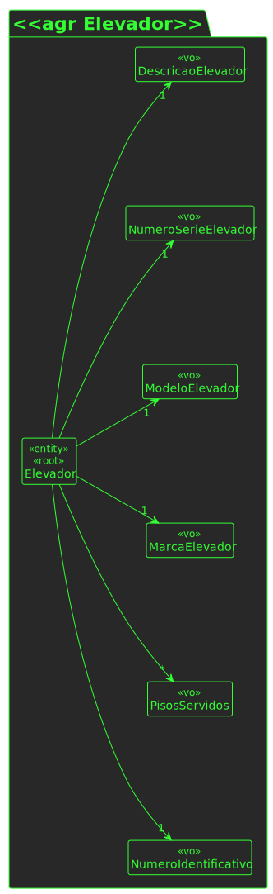
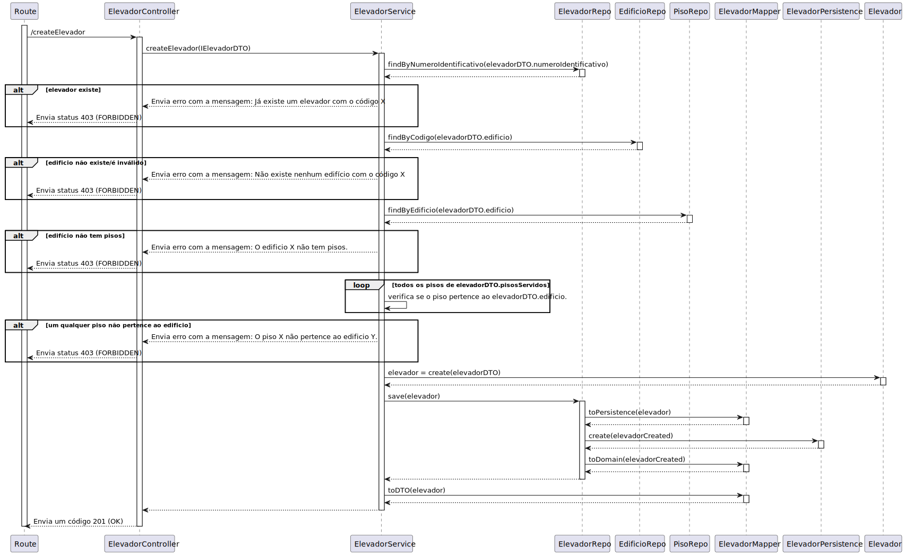

# UC 270

## 1. Requisitos

**UC270** - Criar elevador em edifício.

## 2. Análise

### 2.1 Identificar o problema

Criar um elevador é uma entidade relevante do domínio que existe em edifícios e transporta pessoas de um piso para outro.

> Questão: há alguma restrição para o ID do elevador?
>esse número identificativo tem alguma especificação? era isso que queria perguntar
>
>Resposta: trata-se de um número inteiro
> <><><><><><><><><><><><><><><><><><><><><><><><><><><><><><><><><><><><>
>Questão: Após análise do enunciado deparei-me com a coincidência: todos os edificios que têm elevador, este último serve todos os pisos desse edificio. Pode existir algum edifício em que o elevador não sirva todos os pisos?
>
>Resposta: sim, é possivel tal situação
> <><><><><><><><><><><><><><><><><><><><><><><><><><><><><><><><><><><><>
>Questão: Relativamente à funcionalidade de criar elevador, no seguimento da sua resposta em (https://moodle.isep.ipp.pt/mod/forum/discuss.php?d=25298#p32051), gostaríamos que clarificasse quais das propriedades que indicou serem alfanuméricas podem conter espaços; por exemplo, nós acharíamos que seria sensato a descrição poder conter espaços.
>Adicionalmente, gostaria de saber se o identificador numérico que referiu deve ser fornecido ao sistema ou gerado automaticamente pelo mesmo, dado que este deve ser único dentro de cada edifício.
>
>Resposta: todos os atributos alfanumericos podem conter espaços à exceção do número de série
o número indeitifcativo do elevador deve ser gerado sequencialmente pelo sistema tendo em conta o edifico, por exemplo, existirá o elevador 1 do edificio B e o elevador 1 do edificio A

### 2.2 Testes ao requisito

**Teste 1:** *Criar elevador com sucesso (controlador, 201 POST)*

**Teste 2:** *Criar elevador com insucesso (controlador, 403 FORBIDDEN)*

**Teste 3:** *Criar elevador com sucesso (controlador + serviço, 201 POST)*

**Teste 4:** *Criar elevador com insucesso, edificio não existe (controlador + serviço, 403 FORBIDDEN)*

**Teste 5:** *Criar elevador com insucesso, pisos servidos não pertecem ao edifício/não existem (controlador + serviço, 403 FORBIDDEN)*

**Teste 6:** *Número indentificativo da elevador segue regras de negócio.*

**Teste 7:** *Marca segue regras de negócio.*

**Teste 8:** *Modelo segue regras de negócio.*

**Teste 9:** *Número de série segue regras de negócio.*

**Teste 10:** *Descrição segue regras de negócio.*

## 3. Desenho

Para resolver o problema de criação de elevadores foi criado um agregado com a entidade "Elevador" e os respetivos value objects. Requisitos como este e o UC280, levou a equipa a decidir que um agregado seria a melhor solução para garantir manutenabilidade e expansibilidade. Consideramos ainda tratar o conceito "Elevador" como uma "Passagem". Sendo abstrato, faz sentido, porém optamos pela nossa escolha devido a simplicidade e naturalidade da resolução dos problemas.

### 3.1. Realização

#### 3.3.1 Excerto de domínio

#### 3.3.1 Vista de processo - nível 3

#### 3.3.2 Vista lógica - nível 3

### 3.2. Padrões aplicados

Os padrões aplicados são:

- REST + ONION (padrões arquiteturais);
- DTO;
- Persistence;
- Controller;
- Service;
- Interfaces;
- Schema;
- Mapper;
- Repository;
- Modelo.
