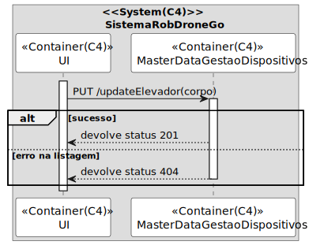
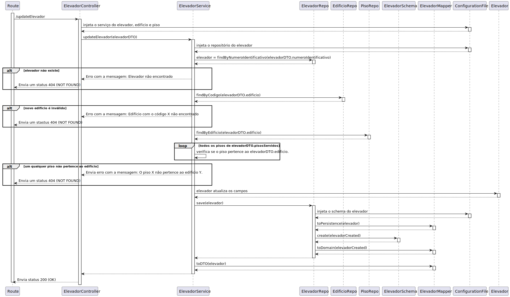

# UC 280

## 1. Requisitos

**UC280** - Editar elevador em edifício.

> Questão: Qual é a informação que o elevador deve manter?
>
> Resposta: edificio (obrigatório)
> número identificativo (obrigatório, único no edificio)
> lista de pisos do edificio servidos pelo elevador (obrigatório)
> marca (opcional, alfanumerico, 50 caracteres)
> modelo (opcional, mas obrigatório se marca for introduzido, alfanumerico, 50 caracteres)
> número de série do fabricante (opcional, alfanumerico, 50 caracteres)
> breve descrição (opcional, alfanumerico, 250 caracteres)

## 2. Análise

### 2.1 Identificação do problema

Editar um elevador é um requisito relevante do domínio que deve ser capaz de atualizar informação de um elevador já existente.

### 2.2 Testes ao requisito

**Teste 1:** *Editar elevador com sucesso (controlador, 201 OK)*

**Teste 2:** *Editar elevador com insucesso (controlador, 404 NOT FOUND)*

**Teste 3:** *Editar elevador com sucesso (controlador + serviço, 201 OK)*

**Teste 4:** *Editar elevador com insucesso (controlador + serviço, 404 NOT FOUND)*

**Teste 5:** *Editar elevador com insucesso, novo edificio não existe (controlador + serviço, 404 NOT FOUND)*

**Teste 6:** *Editar elevador com insucesso, novos pisos servidos não existem/não pertecem ao edifício (controlador + serviço, 404 NOT FOUND)*

## 3. Desenho

Para resolver o problema da edição de elevadores foi criado um agregado com a entidade "Elevador" e os respetivos value objects. Requisitos como este e o UC270, levaram a equipa a decidir que um agregado seria a melhor solução para garantir manutenabilidade e expansibilidade.

### 3.1. Realização

#### 3.1.1 Excerto de domínio

#### 3.1.2 Vista de processo

##### 3.1.2.1 Nível 1

##### 3.1.2.2 Nível 2

##### 3.1.2.3 Nível 3

#### 3.1.3 Vista lógica

##### 3.1.3.1 Nível 1

##### 3.1.3.2 Nível 2

##### 3.1.3.3 Nível 3

#### 3.1.3 Vista de cenários

a

##### 3.1.3.1 Nível 1

a

#### 3.1.4 Vista de implementação

##### 3.1.3.1 Nível 2

##### 3.1.3.1 Nível 3

#### 3.1.5 Vista física

##### 3.1.5.1 Nível 2

### 3.2. Padrões aplicados

Os padrões aplicados são:

- REST + ONION (padrões arquiteturais);
- DTO;
- Persistence;
- Controller;
- Service;
- Interfaces;
- Schema;
- Mapper;
- Repository;
- Modelo.
