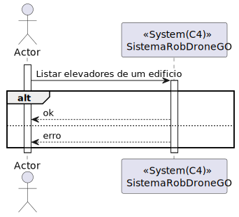
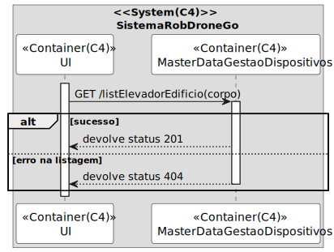
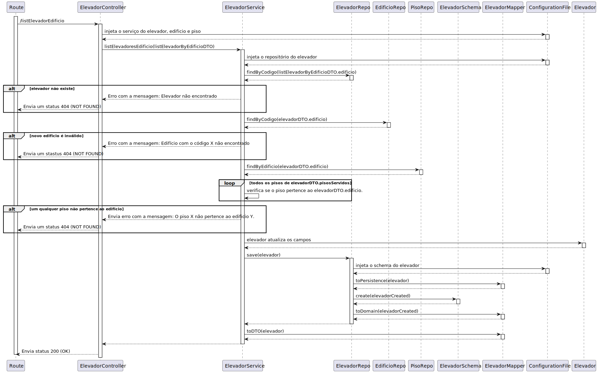

# UC 290

## 1. Requisitos

**UC290** - Listar elevadores em edifício.

> Questão: Já foi aqui, aqui e aqui referido que só é necessário considerar 1 elevador por edifício. Nesta US pretende-se devolver ("listar") apenas 1 elevador. Que informacoes pretende, então, ver sobre esse elevador?
>
> Resposta: Pretende-se listar todas as informações do elevador.
> Notem que quando é dito que podem assumir que existe apenas um elevador é uma maneira de simplificar o problema para esta fase de prototipo, principalmente reduzindo a complexidade dos mapas e do calculo de percursos, mas nada vos impede de suportar vários elevadores no sistema se assim o entenderem
> <><><><><><><><><><><><><><><><><><><><><><><><><><><><><><><><><><><><>
> Questão: O enunciado diz: "Assume-se apenas um elevador por edifício"
>Tendo em conta que só há um elevador por edificio, pretende-se saber qual é o elevador de cada edificio? Ou é suposto haver mais do que um elevador num edificio?
>
> Resposta: De momento apenas necessitam suportar um elevador por edificio

## 2. Análise

### 2.1 Identificação do problema

Listar elevadores de um edíficio deve apresentar o(s) elevador(es) de um edifício específico.

### 2.2 Testes ao requisito

**Teste 1:** *Listar elevador(es) com sucesso (controlador, 200 GET)*

**Teste 2:** *Listar elevador(es) com insucesso (controlador, 404 NOT FOUND)*

**Teste 3:** *Listar elevador(es) com sucesso (controlador + serviço, 200 GET)*

**Teste 4:** *Listar elevador(es) com insucesso (controlador + serviço, 404 NOT FOUND)*

## 3. Desenho

Para resolver o problema de listagem de elevadores foi criado um agregado com a entidade "Edificio" que tem uma ligação singular para o agregado "Elevador". Este requisito levou a equipa a decidir que agregados separados seria a melhor solução para garantir manutenabilidade e expansiblidade.

### 3.1. Realização

#### 3.3.1 Excerto de domínio

#### 3.1.2 Vista de processo

##### 3.1.2.1 Nível 1

##### 3.1.2.2 Nível 2

##### 3.1.2.3 Nível 3

#### 3.1.3 Vista lógica

##### 3.1.3.1 Nível 1

##### 3.1.3.2 Nível 2

##### 3.1.3.3 Nível 3

#### 3.1.3 Vista de cenários

##### 3.1.3.1 Nível 1

#### 3.1.4 Vista de implementação

##### 3.1.3.1 Nível 2

##### 3.1.3.1 Nível 3

#### 3.1.5 Vista física

##### 3.1.5.1 Nível 2

### 3.2. Padrões aplicados

Os padrões aplicados são:

- REST + ONION (padrões arquiteturais);
- DTO;
- Persistence;
- Controller;
- Service;
- Interfaces;
- Schema;
- Mapper;
- Repository;
- Modelo.
