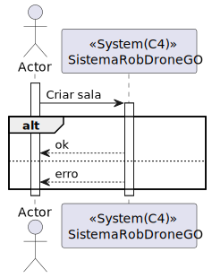
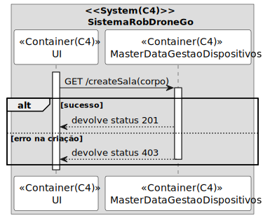
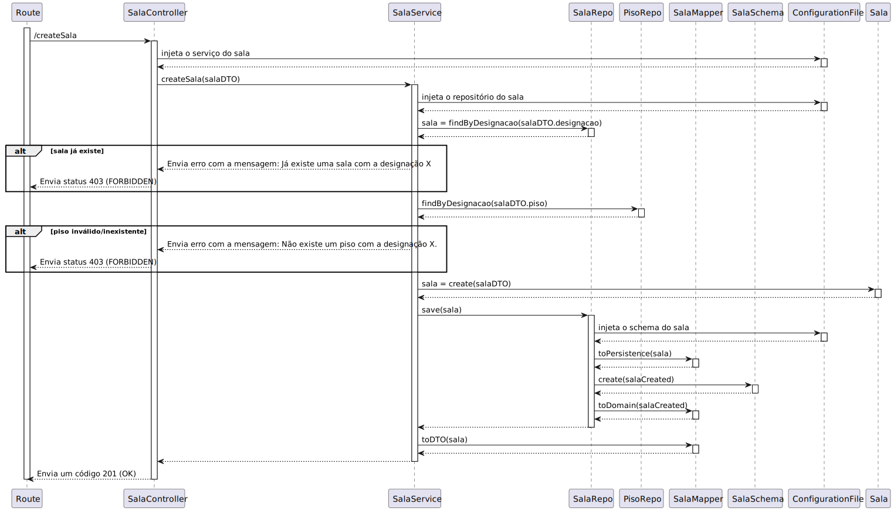

# UC 310

## 1. Requisitos

**UC310** - Criar sala de piso de edifício.

> Questão: Relativamente à informação fornecida pelo cliente referente à US310, ele diz "o requisito 310 Criar sala permite definir um sala num dado piso de um edifício, exemplo sala "B310" no 3º piso do edifício B", este nome da sala é suposto ser criado automaticamente uma vez que a sala saberá o piso em que se encontra e o piso sabe o edifício em que está, sendo apenas preciso verificar o número de salas que esse piso já  tem para saber o número da nova sala ou somos nós que introduzimos o nome da sala e colocamos onde queremos conforme o nome que lhe demos?
>
> Resposta: Esse nome é introduzido pelo utilizador. Não existe semantica prédefinida conhecido do sistema
> <><><><><><><><><><><><><><><><><><><><><><><><><><><><><><><><><><><><>
> Questão: Em relação aos atributos que definem uma sala, quais são os limites desejados para o seu nome e descrição. Ainda, existem algum tamanho mínimo para criar uma sala?
> 
> Resposta: Nome - max 50 caracteres, descrição - max 250 caracteres, tamanho minimo da sala - 1 célula
> <><><><><><><><><><><><><><><><><><><><><><><><><><><><><><><><><><><><>
> Questão: Deveria o nome da sala ser único?
>
> Resposta: Sim.

## 2. Análise

### 2.1 Identificação do problema

Criar uma sala é necessário para os pisos que vão ter várias salas.

### 2.3 Testes ao requisito

**Teste 1:** *Criar sala com sucesso (controlador, 201 POST)*

**Teste 2:** *Criar sala com insucesso (controlador, 403 FORBIDDEN)*

**Teste 3:** *Criar sala com sucesso (controlador + serviço, 201 POST)*

**Teste 4:** *Criar sala com insucesso, piso não existe (controlador + serviço, 403 FORBIDDEN)*

**Teste 5:** *Designação da sala segue regras de negócio.*

**Teste 6:** *Descrição segue regras de negócio.*

## 3. Desenho

Para resolver o problema de sala de piso foi criado um agregado com a entidade "Sala" e três value objects "Designação", "CategoriaSala" e "DesignaçãoSala". Este requisito, levou a equipa a decidir que um agregado seria a melhor solução para garantir manutenabilidade e expansibilidade.

### 3.1. Realização

### 3.1.1 Excerto do MD

#### 3.1.2 Vista de processo

##### 3.1.2.1 Nível 1

#### 3.1.2.2 Nível 2

#### 3.1.2.3 Nível 3

#### 3.1.3 Vista lógica

##### 3.1.3.1 Nível 1

##### 3.1.3.2 Nível 2

##### 3.1.3.3 Nível 3

#### 3.1.3 Vista de cenários

##### 3.1.3.1 Nível 1

a

#### 3.1.4 Vista de implementação

##### 3.1.3.1 Nível 2

##### 3.1.3.1 Nível 3

#### 3.1.5 Vista física

##### 3.1.5.1 Nível 2

### 3.2. Padrões aplicados

Os padrões aplicados são:

- REST + ONION (padrões arquiteturais);
- DTO;
- Persistence;
- Controller;
- Service;
- Interfaces;
- Schema;
- Mapper;
- Repository;
- Modelo.
