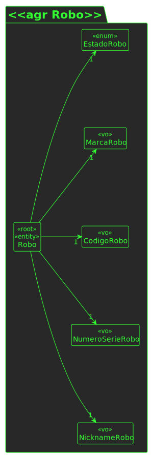

# UC 370

## 1. Requisitos

**UC370** -  Como gestor de frota quero inibir um robô

## 2. Análise

### 2.1 Indentificar o problema
Como gestor de frota quero inibir um robô, sendo que tem de se alterar o estado do robô, através do uso de um método PATCH

### 2.2 Excerto do MD

### 2.3 Testes

#### 2.3.1 Testes de Unidade

**Test 1:** - Assegurar que robô existe

**Test 2:** - Assegurar que código de robô é válido

#### 2.3.2 Testes de Integração

**Test 1** - 

## 3. Design

To solve this problem it is necessary to ask for the parameters for the user (in case we're adding a user), make sure 
they persist in the database to make sure we can solve the US1001_2 and US1001_3.

### 3.1. Realização

### 3.3.1 Diagrama de Sequência

### 3.2. Padrões aplicados
Os padrões aplicados são:
- DTO;
- Persistência;
- Aplicação;
- Controlador;
- Serviço;
- Modelo.