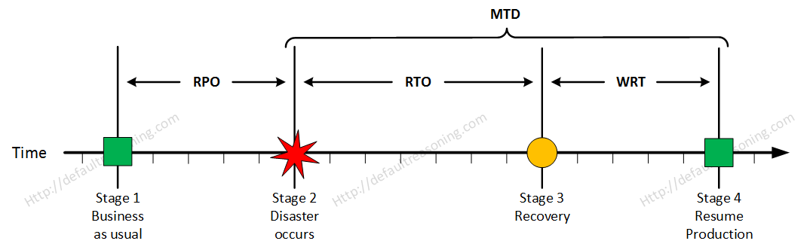

# UC 800

## 1. Requisitos

**UC800** - Como administrador do sistema quero que seja definido o MBCO (Minimum Business Continuity Objective) a propor aos stakeholders

> Questão: Neste contexto, pretende-se que o sistema esteja operacional o máximo de tempo possível.
>
>Sendo assim, é aceite algum período de indisponibidade? Se sim, de quanto tempo? O sistema deverá apresentar funcionalidades parciais durante este período?
>
>Além disso, existe algum máximo de tempo que o sistema, após interromper/paralisar os serviços, deverá voltar a recuperar os dados?
>
> Resposta: Como descrito na US800 "quero que seja definido o MBCO (Minimum Business Continuity Objective) a propor aos stakeholders" o que implica que terá que definir as funcionalidades que lhe parecem mais importantes que sejam mantidas em caso de desastre.
As cópias de segurança (US810) são necessárias e podem implicar a inoperacionalidade da solução. A estratégia implementada nas cópias têm implicação no RPO e no WRT, pelo que terá de definir a mais apropriada.
Sim, é aceite algum tempo de indisponibilidade mas que terá de ser justificado e, claro, o menor possível.
>
> <><><><><><><><><><><><><><><><><><><><><><><><><><><><><><><><><><><><>
>
> Questão: Pode indicar-nos qual a escala horária estabelecida para efeitos de utilização do sistema? É espectável que, para efeitos de backup, haja uma breve interrupção do serviço, no entanto, poderemos recorrer a qualquer período do dia para este efeito.
>
>Neste sentido, gostávamos de saber qual a altura mais favorável do dia para esta breve interrupção.
>
> Resposta: Atendendo aos termos e exemplo do RFP, quer o robisep quer o droneisep podem executar tarefas que não pressupõem ocupação humana (vigilância, limpeza, por exemplo). Já outras tarefas (buscar/entregar um item, por exemplo) pressupõem ocupação humana.
Deverá definir face ao tempo estimado de indisponibilidade do sistema a melhor altura para a breve interrupção face às funções planeadas para os dispositivos.
Em suma, é aceitável uma breve interrupção de serviço mas a altura da indisponibilidade deverá ser proposta por quem responde ao RFP.

## 2. Análise

### 2.1 Identificação do problema

Como se pode verificar na seguinte figura, existem 4 pontos que têm que ser delimitados:

- Recovery Point Objective (RPO);
- Recovery Time Objective (RTO);
- Work Recovery Time (WRT);
- Maximum Tolerable Downtime (MTD).

**Nota:** Imagem figurativa e não se encontra à escala da solução apresentada.

#### Recovery Point Objective

Para definir o RPO, é preciso responder à(s) pergunta(s):

- Qual é o máximo de tempo em que se pode perder informação?

- Quando (frequência e altura do dia (manhã/noite)) é que faz sentido executar cópias de segurança?

#### Maximum Downtown Tolerable

Para definir o MDT, é preciso responder à(s) pergunta(s):

- Qual é o máximo de tempo que desde a perda de dados até o regresso à normalidade pode durar?

## 3. Desenho

Este é um requisito onde as exigências do cliente são cruciais (como qualquer outro use case, mas este especialmente) e vão redigir a proposta MBCO.

### Contexto do sistema

Este sistema contém drones e robôs que executam, fundamentalmente, tarefas de vigilância, entrega de objetos e limpeza.

### Criticidade dos dados

Neste sistema é importante que todos os processos que envolvam as funções dos robôs/drones estejam "sempre" operáveis, sendo considerado o mais crítico a vigilância e a limpeza.

Este sistema trata-se um sistema não crítico por conter funcionalidades dispensáveis ao negócio.

### Custo da baixa do sistema

Sem o sistema, em média, existem custos como:
 - Cerca de 15 minutos por dia com a tarefa de busca de objetos;
 - Limpezas por fazer;
 - Sistema de vigilância sofre vulnerabilidades.
 
Relativamente à busca de objetos, são 75 minutos por semana que 100 pessoas vão perder, resultando em 465 minutos semanais de produtividade. Se por cada 15 minutos as pessoas gerarem 10eur para a empresa, 310eur serão faturados (31 000eur/100pess.), enquanto que com o sistema serão 320eur (32 000eur/100pess). 

Se se optasse por uma solução menos arriscada, ou seja, com execução de cópias de segurança mais frequentes como por exemplo, diariamente, teria um **custo de cerca de 10 000eur**. Enquanto que se se optasse por uma solução mais arriscada com uma frequência de três dias, teria um **custo de cerca de 3333eur.**

As perdas ocorrem **apenas** quando o sistema está em baixo, ou seja, a perda de dados de um dia, em princípio, não afetará, fincanceiramente, o negócio.

Relativamente à limpeza e à vigilância, o seu impacto não seria a nível financeiro, porém teria, obviamente, consequências negativas.

Nota: Os valores utilizados são completamente figurativos, mas com proporção direta para os valores reais.

Em suma, o sistema RobDroneGo não se define como crítico, é algo que apenas auxilía os seus utilizadores e que não impede que as funções dos próprios sejam executadas. O risco pode ser mais elevado tendo isto consequências positivas, como não necessitar de soluções de recuperação mais sofisticadas e dispendiosas. 

### Tecnologias da infraestrutura

Este projeto não dispõe de tecnologias de ponta, rede banda larga medíocre e soluções de armazenamento escassas.

### Conclusão

Apontados os fatores que sustentam a decisão do RPO, a equipa considerou que **3 dias é a frequência necessária e suficiente**. Para o MDT considerou-se **6 horas**.

### Cópia de segurança

#### Execução

Sendo que este processo reduz eficiência ao sistema ou até inoperacionalidade, a melhor altura do dia para executar backups é de madrugada, onde a probabilidade de atividade por parte dos utilizadores é baixa.

#### Localização

É fortemente sugerido que os backups sejam armazenados numa cloud ou num servidor distinto. Isto por serem e estarem fisicamente distintos e distantes. Em caso de desastre no servidor, esta solução salvaguarda o backup.

## 4. Referência

[Figura BCDR](https://defaultreasoning.com/2013/12/10/rpo-rto-wrt-mtd/)
