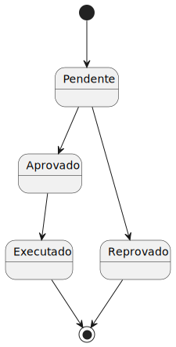

# Master Data Gestão de Tarefas (MDGT)

## Funcionalidades

Módulo de gestão de tarefas. Contém funcionalidades como:

- Utente:
  - Requisição de tarefas (utente).
- Gestor de Tarefas:
  - Aprovação de tarefas (gestor);
  - Geração de sequência de tarefas aceites;
  - Pesquisa por tipo de dispositivo, estado ou utente.

## Workflow

Como se pode verificar no diagrama de estado anterior, as tarefas têm um ciclo de vida limitado.

Quando requisitadas, iniciam-se com o estado 'Pendente'. Após o gestor de tarefas tomar uma decisão pode aprovar a requisição ou reprovar. Na ocasião de reprovar, termina ali a vida da tarefa/aprovação. Porém, se a tarefa for aceite, vai ter que passar por mais um estado.

Em conjunto com todas as outras que forem aceites, será calculado um plano com a forma mais eficiente de executar as tarefas.
